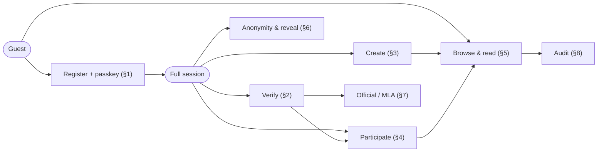
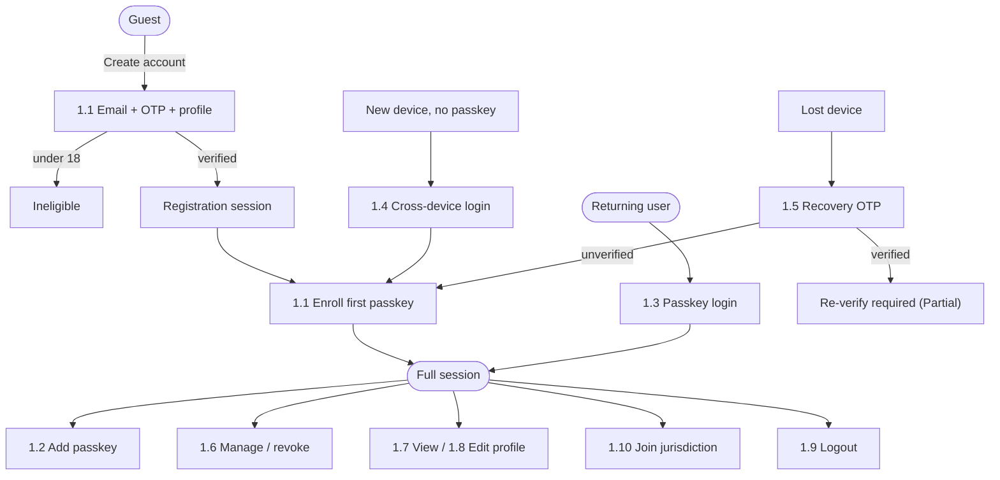
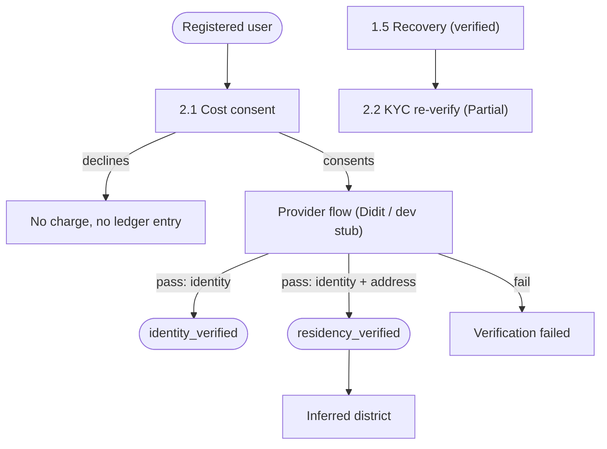
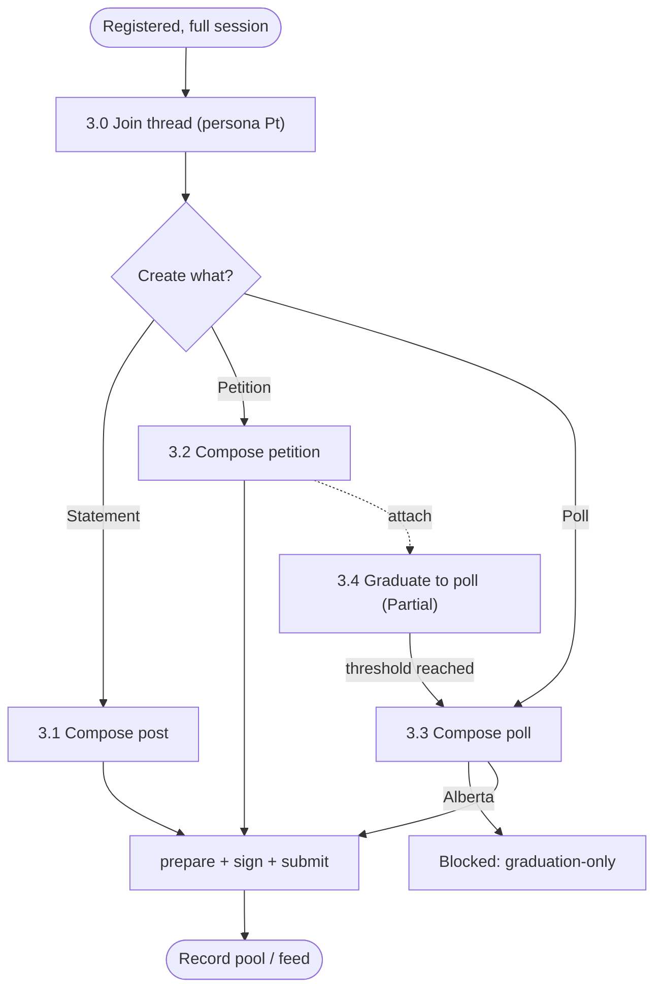
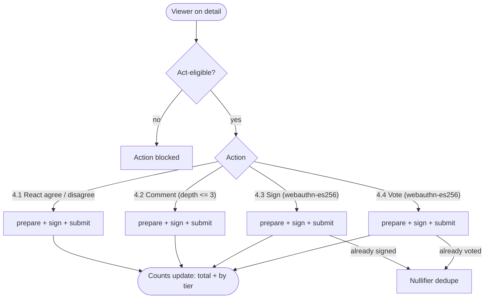
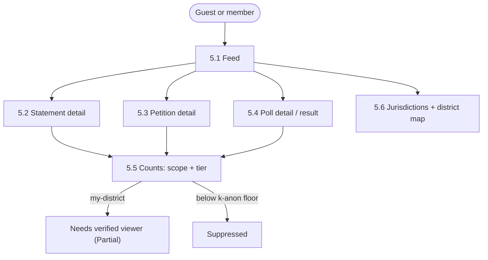
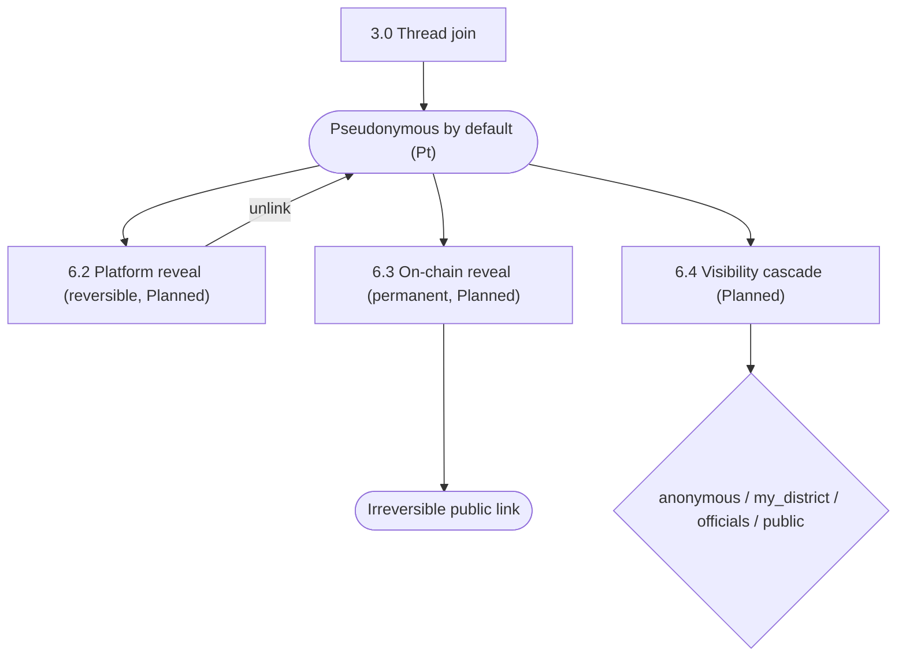
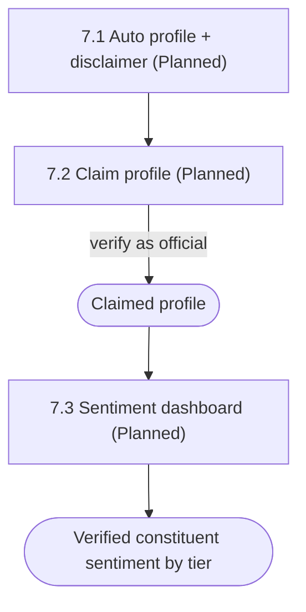
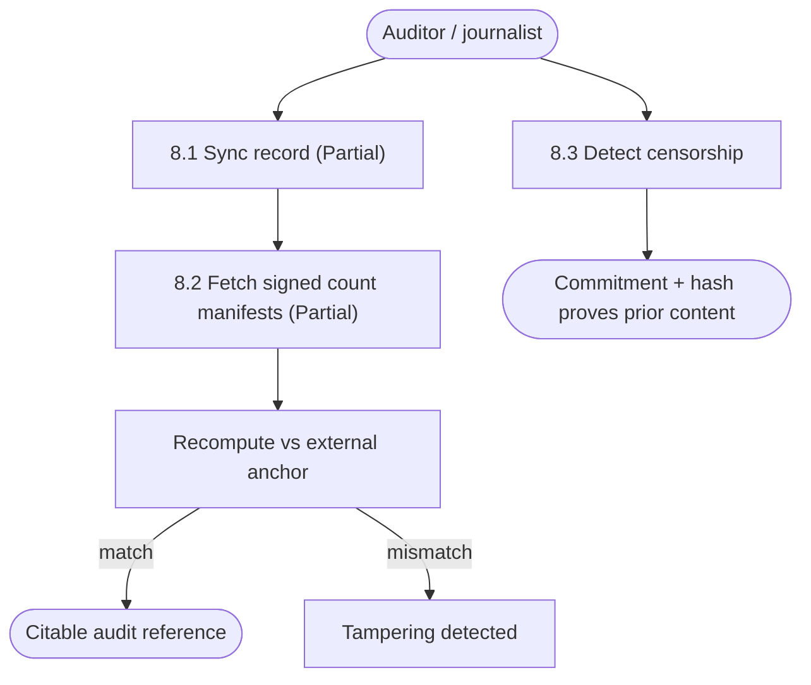

# OurSay — User Flows

> **Purpose:** The screen-by-screen / step-by-step **journey** layer — the bridge between
> [`10-USER-STORIES.md`](10-USER-STORIES.md) (what a role wants + acceptance) and wireframes (what
> screens to draw and how a user moves between them). Each flow is a sequence of steps, the screen/state
> at each step, the decision branches, the end states, and the API/entity behind each step.
>
> **Audience:** Design (wireframes), front-end, product.

## Where this sits (precedence)

This doc **defers to** the documents that own the rules and never redefines them — same precedence as the
stories layer: [`GLOSSARY.md`](GLOSSARY.md) (vocabulary) → [`../public-record/REQUIREMENTS.md`](../public-record/REQUIREMENTS.md)
(`R1`–`R28`) → [`entities/`](entities/README.md) (object structure) → [`PRD.md`](PRD.md) §4–§7 →
[`01-CONTRIBUTOR-SPEC.md`](01-CONTRIBUTOR-SPEC.md). It also defers to [`10-USER-STORIES.md`](10-USER-STORIES.md):
every flow here implements one or more `US-*` stories and cites them.

This is **not** the per-screen flow-spec layer (states, components, copy) that
[`10-USER-STORIES.md`](10-USER-STORIES.md) reserves for `docs/frontend/`. This doc sits **above** that:
it maps the journeys *between* screens so wireframes know which screens must exist and how they connect.
Screen names here are **functional** (`[screen: OTP + profile form]`), not layouts — layout is the
wireframe's job.

## Legend

**Status** — applied per flow, and per step where it differs:

| Tag | Meaning |
|-----|---------|
| **Built** | A real `/v1` route/service backs this today (route cited). |
| **Partial** | Service layer exists but HTTP/integration is missing, or interim behavior (gap tag cited). |
| **Planned** | Design-only / future; no implementation yet (story or roadmap tag cited). |

**Step notation:**
`N. <user action>  [screen: …] / [state: …]   -> METHOD /v1/…` (or `-> entity` when no HTTP surface).
`branch:` lines capture decisions and error/abandon paths. Each flow ends with **End (success)** and,
where relevant, **End (error/abandon)**.

> ⚠️ **No product UI exists yet.** The application web app is **Phase D** (not built). Every "Built"
> tag below means the *API* is built and exercised by the dev harness `api/web/walktest/` (`/walk`), not
> that a styled screen exists. Screen names describe the UI the wireframes will define on top of those
> APIs.

## Status summary

| Flow group | Overall | Notes |
|------------|---------|-------|
| 1. Account & auth | Built (API) | Register, passkey, login, recovery, sessions all wired; profile **update** is Partial. |
| 2. Verification | Partial | Stub KYC provider (`/v1/dev/kyc/attest`); real Didit + recovery re-verify are gaps. |
| 3. Civic content — create | Built (API) | join → prepare → submit covers post/petition/poll. |
| 4. Civic content — participate | Built (API) | react/comment/sign/vote via same submit path. |
| 5. Browse & read | Built (API) | Lists + detail + counts (geo/tier/k-anon resolved on counts only). |
| 6. Anonymity & privacy | Mixed | Per-thread pseudonym Built; reveal + visibility cascade Planned. |
| 7. Official / MLA | Planned | Auto-profiles + claim + sentiment dashboard are fast-follow/future. |
| 8. Auditor / transparency | Partial | Record exists; signed count manifests + full sync endpoint are gaps. |

## Personas

Concrete roles (from [`10-USER-STORIES.md`](10-USER-STORIES.md) §Roles; tiers are **set membership**,
not a ladder):

| Persona | Account? | Tier | Launch timing | Can do (headline) |
|---------|----------|------|---------------|-------------------|
| **Guest** | no | — | MVP | Browse all public content, counts, results, district maps, audit data. |
| **Registered (unverified)** | yes | `unverified` | MVP | Everything a guest can, plus create/react/comment/sign/vote where the jurisdiction permits unverified action (counted separately). |
| **Identity-verified** | yes | `identity_verified` | MVP | As registered, with actions counted at the identity-verified tier. |
| **Residency-verified** | yes | `residency_verified` | MVP | As identity-verified, plus address-inferred district → my-district filters, district-distinguished counts. |
| **Subscriber** | yes | any | MVP (foundation) | A registered user who is a *member* of a named jurisdiction; drives the jurisdiction selector. |
| **Official (MLA)** | yes (claimed) | verified | fast-follow | Claim auto-generated profile; see constituency verified sentiment. No moderation powers. |
| **Auditor / Journalist** | no | — | MVP | Sync the record, verify counts against anchors, cite district/tier counts. |
| **Administrator** | n/a | — | off-surface | Moderation / user management; not a product-surface persona (no flows here). |
| **Electoral-validated** | yes | `electoral_validated` | future | Elections-Alberta tier; not launch. |

**Eligibility is two gates** (carried from stories §Roles): **act-eligibility** (may the member perform
the action at all — jurisdiction config) and **official-eligibility** (does it count in the *signed/official*
total — the thread's `appliesToVerified`). Flows note where a gate decides a branch.

## Eligibility matrices (who may act, per jurisdiction)

Reused verbatim from [`10-USER-STORIES.md`](10-USER-STORIES.md) §3–§5. `<DECISION>` rows are **open
product decisions** — the front end must not assume a resolution.

### `ab-ca-gov` (Alberta) — partial ladder · `labels.district = riding`

| Action | May act (act-eligibility) | Counts officially (`appliesToVerified`) | Notes |
|--------|---------------------------|------------------------------------------|-------|
| create `post` (Belief/Statement) | any registered subscriber | — (reactions counted by tier) | open |
| react / comment | any registered subscriber | by tier | |
| create `petition` | `residency-verified` | — | |
| sign `petition` | **`<DECISION>`** — any registered, or residency-verified? | `residency-verified` | public-sign vs verified-only |
| create `poll` | **∅ (graduation-only)** | — | poll only via petition graduation |
| `vote` | **`<DECISION>`** — public voting, or verified-only? | `residency-verified` | "public vote, verified count" |

### `oursay-global` — open model (every account auto-joins)

| Action | May act | Counts officially | Notes |
|--------|---------|-------------------|-------|
| create `post` / react / comment | any registered | by tier | |
| create `petition` | any registered | by tier | no graduation gate |
| sign `petition` | any registered | **`<DECISION>`** — identity-verified default? | permissive act |
| create `poll` | any registered | by tier | **standalone polls allowed** |
| `vote` | any registered | **`<DECISION>`** — identity-verified default? | public voting |

### `some-strict` (reference, private, future) — full ladder

All actions `residency-verified`; `create poll = ∅` (graduation-only); residency-gated subscribe. See
stories §5 for the matrix; flows below note strict-only deltas where relevant.

---

## Journey overview

How the flow groups connect end to end. Section numbers in brackets.

## 1. Account & auth

Session scopes gate what a step may do: **registration** (enroll first passkey only) · **login**
(enroll-only) · **recovery** (enroll fresh passkey only, revokes prior sessions) · **full** (all civic
actions). [`entities/auth/session.md`](entities/auth/session.md).

### 1.1 Register → first civic action  ·  Guest → Registered  ·  Built  ·  US-SYS-1, US-SYS-2

**Entry:** Guest taps "Create account" from any read view.

1. Enter email  `[screen: Email capture]`  `-> POST /v1/auth/otp/request {purpose:"registration"}`
   - branch: email already registered → unauthenticated request is a **silent no-op** (no enumeration); UI shows "check your email" regardless.
2. Enter code + profile (name, address, birthdate, `over_18`)  `[screen: OTP + profile form]`  `-> POST /v1/auth/otp/verify`
   - branch: under 18 → `[screen: Ineligible]`, no account created (age gate in `RegistrationService`).
   - branch: code wrong/expired → `[state: inline error]`, allow resend (rate-limited 10/min request, 20/min verify).
   - on success: account created, auto-subscribed to `oursay-global`, address best-effort geocoded to a **private** point (`auth.profile_geocodes`); session issued at **registration** scope.
3. Enroll first passkey  `[screen: WebAuthn prompt]`  `-> POST /v1/auth/passkey/register/options` → device ceremony → `-> POST /v1/auth/passkey/register/verify`
   - branch: user dismisses WebAuthn → `[state: passkey pending]`; account exists but can only re-enroll (registration scope) — see 1.5 abandon note.
4. Log in with the new passkey to upgrade scope  `-> POST /v1/auth/passkey/login/options` → `-> POST /v1/auth/passkey/login/verify` → **full** session.

**End (success):** Full session → Home feed (5.1), ready to act.
**End (error/abandon):** Account with registration-scope session and no passkey; user can resume by enrolling a passkey or recover later (1.5).
**Notes:** Email-OTP codes are hashed per row, never stored or logged in plaintext. Joining a *thread* to act is a separate step (3.0), done on first civic action.

### 1.2 Enroll an additional passkey (same account)  ·  Registered  ·  Built  ·  US-SYS-2

**Entry:** Settings → "Add a passkey" (full session, already has ≥1 passkey).

1. Begin enrollment  `[screen: Passkeys settings]`  `-> POST /v1/auth/passkey/register/options`
2. Device ceremony → `-> POST /v1/auth/passkey/register/verify`

**End (success):** New passkey listed; **additive** — does not revoke other sessions/passkeys.
**Notes:** For enrolling a passkey on a *brand-new device that has none*, use cross-device login (1.4).

### 1.3 Login on a device that already has a passkey  ·  Registered  ·  Built  ·  US-SYS-2

**Entry:** Returning user, login screen.

1. Tap "Sign in"  `[screen: Login]`  `-> POST /v1/auth/passkey/login/options` → device ceremony → `-> POST /v1/auth/passkey/login/verify`
   - branch: assertion fails → `[state: inline error]`, retry (rate-limited 30/min).

**End (success):** **full** session → Home feed.

### 1.4 Cross-device login (new device, no passkey yet)  ·  Registered  ·  Built  ·  US-SYS-2

**Entry:** New device with no passkey; a *trusted* device (full session + enrolled passkey) authorizes a login window.

1. On trusted device: "Allow a new device to sign in"  `[screen: Add device]`  `-> POST /v1/auth/login/enable` (opens 10-min window, sends a `login` OTP to the account email)
2. On new device: enter the emailed code  `[screen: Enter login code]`  `-> POST /v1/auth/login/verify` → **login**-scoped session (enroll-only)
   - branch: no window open → `login` OTP request is a **silent no-op** (no bypass, no enumeration).
3. On new device: enroll a passkey  `-> POST /v1/auth/passkey/register/{options,verify}`
4. Sign in with it (1.3) → **full** session.

**End (success):** New device has its own passkey and full session; **other sessions are not revoked**.
**Notes:** Distinct from recovery (1.5): cross-device login is additive and non-destructive.

### 1.5 Recovery — lost device  ·  Registered  ·  Built (unverified) / Partial (verified)  ·  US-SYS-3, US-SYS-5

**Entry:** Login screen → "Lost your device?"

1. Request recovery code  `[screen: Recover account]`  `-> POST /v1/auth/otp/request {purpose:"recovery"}` (sent only if account exists; no enumeration)
2. Enter code  `[screen: Enter recovery code]`  `-> POST /v1/auth/recovery/verify`
   - branch (**unverified account**): → **recovery**-scoped session (enroll-only). Continue to step 3. **Built.**
   - branch (**verified account**): → `409 kyc_reverification_required` `[screen: Re-verify required]`; user must re-verify with the KYC provider before verified tier is restored. **Partial** — real provider not integrated (`[mvp-c-kyc-provider]`).
3. Enroll a fresh passkey  `-> POST /v1/auth/passkey/register/{options,verify}` → sign in (1.3) → full session.

**End (success):** New passkey; **all prior sessions revoked** (security reset). Persona `Pₜ` and thread bindings **preserved**; per-thread civic credentials were revoked, so the user re-authorizes per thread by enrolling a fresh signer under the same `Pₜ` on next civic action (3.0).
**End (error/abandon, verified):** Account stuck at re-verify gate until provider flow ships.
**Notes:** Contrast 1.4 — recovery is destructive to sessions by design.

### 1.6 Manage / revoke passkeys  ·  Registered  ·  Built  ·  US-SYS-2

**Entry:** Settings → Passkeys (full session).

1. View enrolled passkeys  `[screen: Passkeys settings]`  `-> GET /v1/auth/passkeys`
2. Revoke one  `-> POST /v1/auth/passkey/revoke`
   - branch: attempt to revoke the **last** passkey → rejected (`403`); UI must keep at least one (or guide to recovery).
   - on success: sessions paired to that credential are revoked.

**End (success):** Passkey removed; other devices unaffected.

### 1.7 View profile (private PII)  ·  Registered  ·  Built  ·  US-SYS-1

**Entry:** Settings → Profile (full session).

1. View own profile (email, birthdate, address, handle, memo)  `[screen: Profile]`  `-> GET /v1/profile`

**End (success):** Profile shown. PII is private to the owner; never on the public record.

### 1.8 Update profile / address (re-geocode)  ·  Registered  ·  Partial  ·  US-CAP-12 (district inference)

**Entry:** Settings → Profile → "Edit".

1. Edit address fields  `[screen: Edit profile]`  `-> PATCH /v1/profile` **(gap: no HTTP route yet — `[mvp-c10c-profile-patch]`)**
2. On save, address re-geocoded to a new private point + history append (`GeocodeService.syncGeocodeForUser` exists; not exposed).

**End (success, when shipped):** New inferred district drives my-district filters (5.5).
**Notes:** Service layer exists; only the HTTP surface is missing.

### 1.10 Join / switch jurisdiction (membership)  ·  Registered  ·  Partial  ·  US-SYS-6, US-STR-1

**Entry:** Jurisdiction selector → "Join" or "Switch jurisdiction".

1. Browse joinable jurisdictions  `[screen: Jurisdiction selector]`  `-> GET /v1/public/jurisdictions`
2. Join one  `[screen: Join jurisdiction]`  `-> (gap: no membership/subscribe API — `[mvp-c10b-membership]`)`
   - every account is auto-subscribed to `oursay-global` at registration (1.1); explicit join is the gap.
   - branch (**`some-strict` / residency-gated**, US-STR-1, future): join requires residency verification *within* that jurisdiction; non-residents cannot subscribe or see gated content; jurisdiction marked private in the catalog.

**End (success, when shipped):** Membership drives the selector and the unified feed (5.1).
**Notes:** At launch only `ab-ca-gov` is reachable through the UI; the membership *foundation* (selector + "my jurisdictions") is the MVP target even with a single active chain.

### 1.9 Session & logout  ·  Registered  ·  Built

**Entry:** Any authenticated state.

1. Check current session (userId, scope)  `-> GET /v1/auth/session` (drives "am I signed in / what can I do").
2. Logout  `[screen: any]`  `-> POST /v1/auth/logout` → session revoked, cookie cleared.

**End (success):** Returned to guest read state.

---

## 2. Verification (KYC tiers)

Tiers are set membership: `unverified` → `identity_verified` (name + age) and/or `residency_verified`
(identity + address → inferred district). [`entities/account/verification.md`](entities/account/verification.md).
Residency verification is **not** electoral eligibility.

### 2.1 Verify identity / residency  ·  Registered → Verified  ·  Partial  ·  US-SYS-4

**Entry:** Settings → "Verify identity".

1. Review exact at-cost price + consent  `[screen: Verification cost consent]`
   - branch: user declines price → `[state: not started]`, no charge, no ledger entry. **Required** before proceeding.
2. Run provider flow  `[screen: Provider (Didit) handoff]`
   - **Built today:** dev stub via `-> POST /v1/dev/kyc/attest` (self-attest a tier for QA; dev-only).
   - **Partial:** real **Didit** integration (dev: ID-only + platform self-signed address; prod: ~$2 CAD POA) — `[code-didit-provider]`.
3. Provider returns  `[state: result]`:
   - branch: pass (identity only) → award `identity_verified`; write a public-record entry linking the **pseudonymous** identity to the tier (no PII).
   - branch: pass (identity + address) → award `residency_verified`; geocode address → inferred district.
   - branch: fail → `[screen: Verification failed]`, no ledger entry, may retry.

**End (success):** Tier reflected in all subsequent civic actions and count breakdowns.
**Notes:** Provider is pluggable (stub default; Didit MVP; Equifax / Elections-Alberta future). No PII on ledger.

### 2.2 KYC re-verification during recovery  ·  Verified  ·  Partial  ·  US-SYS-5

See 1.5 verified branch. Requires re-verify before restoring verified tier; gated by `409` today, real
provider pending (`[mvp-c-kyc-provider]`).

### 2.3 Sponsor another user's verification  ·  any  ·  Planned

Pay for another user's verification; outcomes (pass/fail/not-completed) publicly recorded; 30-day window.
Documented in PRD §5.6; **not implemented**, not launch.

---

## 3. Civic content — create

All writes go through the same three-step civic path. Audience (`jurisdictionId` + `appliesToRegion` +
`appliesToVerified`) is declared on the **root** entity and inherited by children; it may narrow, never
widen. Verified actions land on-ledger; unverified stay in Postgres only.

### 3.0 Join a thread (prerequisite for any write)  ·  Registered  ·  Built  ·  US-CAP-9

**Entry:** First time this device acts in a given thread (implicit, triggered by any create/participate action).

1. Register this device's signer under a stable per-thread persona `Pₜ`  `-> POST /v1/civic/threads/join` (full session)
   - first-wins per `(user, thread)`: same `Pₜ` reused on subsequent joins; after recovery (1.5) a fresh signer is enrolled under the same `Pₜ`.

**End (success):** Device can sign appends for this thread pseudonymously.

### 3.1 Create a statement (post / "Belief")  ·  eligible member  ·  Built  ·  US-CAP-1

**Entry:** "New statement" (Alberta label: "Belief").

1. Compose: `title` (required ≤200) + `body` (optional ≤2000) + optional jurisdiction/audience selector  `[screen: Compose statement]`
   - branch: title empty or over caps → `[state: validation error]` (`contentLimits.post`).
   - branch: not act-eligible (matrix) → `[state: action blocked]` with reason.
   - branch (**`some-strict`**, US-STR-2, future): creator may designate the post **solely to one district** (`appliesToRegion` = district, `appliesToVerified` = residency-verified); inherited by comments/reactions, may narrow but never widen; non-residents are rejected and never exposed in counts.
2. Prepare server-derived fields  `-> POST /v1/civic/appends/prepare {type:"post"}`
3. Sign envelope on device → submit  `-> POST /v1/civic/appends/submit` → record pool.

**End (success):** Post appears in the jurisdiction feed (5.1) and public record; defaults to `oursay-global` if no jurisdiction chosen.
**Notes:** A post is a root entity bound to exactly one `jurisdictionId`.

### 3.2 Create a petition  ·  eligible member  ·  Built  ·  US-CAP-4

**Entry:** "New petition" (Alberta: act-eligibility = `residency-verified`).

1. Compose: `title` (≤200) + `text` (required, ≤cap) + optional deadline + audience; `addressedTo` inferred from audience (district → seated MLA(s); jurisdiction-wide → Legislature), platform-overridable  `[screen: Compose petition]`
   - branch: not act-eligible (`graduation.createTier.petition`; may be ∅) → `[state: action blocked]`.
2. `-> POST /v1/civic/appends/prepare {type:"petition"}` → 3. sign → `-> POST /v1/civic/appends/submit`.

**End (success):** Petition `open`; status path open → closed → delivered → responded (responded = future).
**Notes:** Optionally pre-attach a poll for graduation (3.4).

### 3.3 Create a poll (standalone)  ·  eligible member  ·  Built (API) / blocked in Alberta  ·  US-CAP-7

**Entry:** "New poll".

- branch (**Alberta**): create `poll` = **∅** → standalone creation blocked; poll exists only by graduation (3.4). `[screen: not available]`.
- branch (**oursay-global**): any registered may create.

1. Compose: `question` (≤200) + `options[]` (2–10, each ≤100) + optional `description` (≤2000) + rules (`allowChange`, deadline, `appliesToVerified`)  `[screen: Compose poll]`
2. `-> POST /v1/civic/appends/prepare {type:"poll"}` → 3. sign → `-> POST /v1/civic/appends/submit`.

**End (success):** Poll `upcoming/active`; lifecycle upcoming → active → closed → result.

### 3.4 Attach / graduate petition → poll · creator deadlines  ·  petition creator + automatic  ·  Partial  ·  US-CAP-6, US-AB-1, US-GLB-1

**Entry:** Petition compose/edit → "Attach a poll that starts if this succeeds".

1. Link a poll definition to the petition  `[screen: Attach poll]`  `-> entity (poll linked to petition)`
2. Set lifecycle controls (**`oursay-global`**, US-GLB-1): explicit deadline or duration, and opt the petition into/out of auto-graduation; defaults fall back to `defaultDeadline`.  `[screen: Lifecycle settings]`
3. **Automatic:** when the petition reaches the verified-signature threshold, the poll **auto-starts**, deadline per `deadlineSource`.  **(gap: graduation engine not built — `[code-jurisdiction-graduation]`)**

**End (success, when shipped):** Poll graduates with the weight of a successful petition.
**End (interim):** Link is informational; no auto-start. In `oursay-global`, the poll can also follow direct-create (3.3).

---

## 4. Civic content — participate

Same join → prepare → submit path (3.0). Signatures and votes are **final by default** and use
hardware-backed `webauthn-es256` (per-action user verification).

### 4.1 React (agree / disagree)  ·  eligible member  ·  Built  ·  US-CAP-2

**Entry:** ✓ / ✗ control on a statement or comment.

1. Tap agree (`check`) or disagree (`cross`)  `[screen: detail/thread]`  `-> prepare {type:"reaction"}` → sign → `submit`
   - mutually exclusive: one active reaction per author + parent; tapping the other switches it; tapping again clears.
   - branch: not act-eligible → `[state: action blocked]`.

**End (success):** Tally updates (total + by tier). Verified on-ledger; unverified off-ledger.

### 4.2 Comment  ·  eligible member  ·  Built  ·  US-CAP-3

**Entry:** "Reply" on any root entity, result, or comment.

1. Write comment (`body` ≤ `contentLimits.comment`)  `[screen: Comment composer]`
   - branch: depth would exceed **3 levels** below root → reply control disabled.
   - branch: not act-eligible → `[state: action blocked]`.
2. `-> prepare {type:"comment"}` → sign → `submit`.

**End (success):** Comment appears in thread; inherits root audience (cannot widen).
**Notes:** Author/admin may delete; the hash is retained (removal is visible, not silent — 8.3).

### 4.3 Sign a petition  ·  eligible member  ·  Built  ·  US-CAP-5

**Entry:** "Sign" on a petition.

1. Optional comment + optional anonymous flag  `[screen: Sign petition]` (comment hidden if anonymous)
   - branch: already signed → blocked by **nullifier** dedupe (one signature per `(user, petition)`).
   - branch: deadline passed / petition closed → `[state: signing closed]`.
   - branch: not act-eligible (`<DECISION>` in Alberta) → `[state: action blocked]`.
2. `-> prepare {type:"petition_signature"}` → **`webauthn-es256`** ceremony → `submit`.

**End (success):** Counts as **official** only if signer tier ∈ `appliesToVerified`; otherwise **unofficial** where the act is permitted. Final by default; revoke only if `allowRevoke` + before deadline.

### 4.4 Vote in a poll  ·  eligible member  ·  Built  ·  US-CAP-7

**Entry:** Poll options on an active poll.

1. Select one option + optional anonymous flag  `[screen: Vote]`
   - branch: already voted → blocked by **nullifier** (one vote per `(user, poll)`); change only if `allowChange` + before deadline.
   - branch: poll not active / closed → `[state: voting closed]`.
   - branch: not act-eligible (`<DECISION>` in Alberta) → `[state: action blocked]`.
2. `-> prepare {type:"vote"}` → **`webauthn-es256`** ceremony → `submit`.

**End (success):** Vote recorded; anonymous verified votes show **tier only** (e.g. "Residency Verified — Anonymous"). Official iff voter tier ∈ `appliesToVerified`.

---

## 5. Browse & read (guest-capable)

All read flows work without an account. [`public-record-read.routes.ts`](../api/src/http/routes/public-record-read.routes.ts),
[`public-area-catalog.routes.ts`](../api/src/http/routes/public-area-catalog.routes.ts).

### 5.1 Browse feed  ·  Guest+  ·  Built  ·  US-SYS-7

**Entry:** Home / a jurisdiction landing.

1. Browse statements / petitions / polls (newest first)  `[screen: Feed]`  `-> GET /v1/public/{posts,petitions,polls}`
   - branch: jurisdiction filter → derived from membership (US-SYS-6); at launch a single active chain (selector may be a one-option/hidden control).

**End (success):** Rows carry `jurisdictionId`, `entityId`, `type`, audience scope.
**Notes:** List filters (scope/tier/date) are **echoed, not resolved** on lists today; resolution is on counts (5.4).

### 5.2 Statement detail  ·  Guest+  ·  Built  ·  US-CAP-1/2/3

1. Open a post  `[screen: Statement detail]`  `-> GET /v1/public/posts/:id` (root + comment tree + reaction tallies)
2. Act if signed in: react (4.1), comment (4.2).

### 5.3 Petition detail  ·  Guest+  ·  Built  ·  US-CAP-4/5

1. Open a petition  `[screen: Petition detail]`  `-> GET /v1/public/petitions/:id` (petition + signature scalar, policy-gated)
2. Act if eligible: sign (4.3), comment (4.2).

### 5.4 Poll detail & result  ·  Guest+  ·  Built (live recompute) / Partial (formal result)  ·  US-CAP-7, US-CAP-8

1. Open a poll  `[screen: Poll detail / Result]`  `-> GET /v1/public/polls/:id` (poll + vote results)
2. Vote if eligible (4.4); after close, view result.

**Notes:** A formal derived `result` entity is a **gap** (`[mvp-c12-poll-results]`); until then results are shown honestly as **live recompute**, labelled as such.

### 5.5 Counts — scope, tier, my-district  ·  Guest+ / Residency-verified  ·  Built (Partial: my-district)  ·  US-CAP-11, US-CAP-12, US-AB-2, US-GLB-2, US-GLB-3

**Entry:** "Breakdown" on any post/petition/poll detail.

1. Request counts  `-> GET /v1/public/{posts,petitions,polls}/:id/counts`
   - caller passes **entity id only** — never a district or user.
   - output: per option / reaction kind, breakable by **geo scope** (`jurisdiction` / `impacted-region` / `my-district` / `all-public`) AND **tier** (identity-verified / residency-verified / unverified), official vs unofficial distinguished.
2. Filter to **my district**  `[screen: Counts → "My riding"]`
   - branch: `scope=my-district` requires an authenticated viewer with a verified address; **inert without it (gap: `[mvp-c4c-my-district]`)** — needs viewer district context.
   - branch (Alberta US-AB-2): in-region vs out-of-region residency-verified split shown; label "riding".
   - branch: any bucket below `privacy.kAnonymityFloor` → `{ count: null, suppressed: true }` (k-anonymity).
   - branch (US-GLB-3, future): compose region filters (And/Or/Not across presets, up to whole-jurisdiction extents) to isolate residency-verified opinion at any scale — `[mvp-c5-region-presets]`.

**End (success):** Honest tier/geo breakdown with k-anon protection.
**Notes:** Date-range filters echoed but not resolved (`[mvp-c4b-date-filters]`). Action-time tier/geo snapshots are a gap; counts use current tier/address (`[mvp-c4-action-snapshots]`).

### 5.6 Browse jurisdictions & district map  ·  Guest+  ·  Built  ·  US-AB-2

1. List jurisdictions (id, level, labels, content caps, count policy)  `-> GET /v1/public/jurisdictions`
2. List districts at a date  `[screen: District directory]`  `-> GET /v1/public/jurisdictions/:jurisdictionId/districts?asOf=` (effective-dated; default today UTC)
3. View one district's boundary  `[screen: District map]`  `-> GET /v1/public/jurisdictions/:jurisdictionId/districts/:revisionId/geometry` (GeoJSON MultiPolygon, EPSG:4326).

**End (success):** Official boundaries shown; redraws are new effective-dated revisions, not edits.

---

## 6. Anonymity & privacy

Participation is **pseudonymous by default** under a per-thread persona `Pₜ`; cross-thread activity is
unlinked without an explicit reveal. [`08-IDENTITY-AND-DEVICE-POLICY.md`](08-IDENTITY-AND-DEVICE-POLICY.md) §4,
[`09-ACCOUNT-PRIVACY-MODEL.md`](09-ACCOUNT-PRIVACY-MODEL.md).

### 6.1 Pseudonymous-by-default  ·  Registered  ·  Built  ·  US-CAP-9

Established at thread join (3.0). The public record shows only `Pₜ` + signature — never the account id or
a cross-thread correlation.

### 6.2 Platform reveal (link / unlink persona ↔ profile)  ·  Registered  ·  Planned  ·  US-CAP-9

**Entry:** Thread or profile → "Show this is me here".

1. Link `Pₜ` → public profile  `[screen: Reveal (reversible)]`  `-> entity (private user↔persona mapping; never on ledger)`
2. Unlink later  `[screen: Reveal settings]` — reversible.

**End (success):** Persona shown as the profile in that thread; can be undone.
**Notes:** Mechanics designed (private registry `thread_bindings`); UI/flow is **Planned** (`[code-privacy-schema]`).

### 6.3 On-chain reveal (permanent)  ·  Registered  ·  Planned (future V1)  ·  US-CAP-10

**Entry:** Reveal settings → "Permanently link on the public record".

1. Explicit, informed confirmation distinguishing it from the reversible platform reveal  `[screen: Nuclear reveal confirm]`
2. Permanently links pseudonym → identity on the record (auditor-verifiable without trusting the platform).

**End (success):** Irreversible public link. **Not built.**

### 6.4 Selective visibility cascade  ·  Residency-verified  ·  Planned (future V1)  ·  US-AB-5

**Entry:** Privacy settings → visibility.

1. Choose visibility: `anonymous | my_district | officials | public`  `[screen: Visibility]`
   - resolution cascades thread (narrow-only) > jurisdiction > account > anonymous floor; widening rejected.
   - out-of-scope viewers get **404** (not 403) on profile lookups.

**End (success, when shipped):** Known locally to officials/district without being globally public. **Design-only** (`[code-privacy-schema]`).

---

## 7. Official / MLA

No moderation powers; officials are ordinary participants with a claimable profile.

### 7.1 Auto-generated profile + disclaimer  ·  Guest+ viewing  ·  Planned  ·  US-AB-3

At launch, read-only MLA profiles are generated from public record (87 in Alberta), each with a
disclaimer: *"generated from public record; [Name] has not endorsed this platform and may be unaware."*
`[screen: Official profile (unclaimed)]`. Auto-generation is fast-follow scope.

### 7.2 Claim a profile  ·  Official  ·  Planned (fast-follow)  ·  US-AB-3

**Entry:** Official finds their profile → "This is me".

1. Verify as the official (public-record lookup or KYC provider official tag)  `[screen: Claim profile]`
2. On success: disclaimer replaced with a "claimed" indicator; the official's posts/comments/reactions may link to the profile.

**End (success):** Attributable participation. **Not built.**

### 7.3 Constituency sentiment dashboard  ·  Official  ·  Planned (fast-follow)  ·  US-AB-4

**Entry:** Claimed official → "My constituency".

1. View threads whose `appliesToRegion` covers the official's district (or jurisdiction-wide)  `[screen: Sentiment dashboard]`
2. Breakdown by tier; respects `countGating` and `kAnonymityFloor` (narrow buckets suppressed).

**End (success):** See verified constituent will without commissioning a poll. **Not built.**

---

## 8. Auditor / transparency

No account required. The trust model: independently recompute any published total from a held copy.

### 8.1 Sync the public record  ·  Auditor  ·  Partial  ·  US-SYS-8

**Entry:** Auditor tooling (not the app UI).

1. Pull a full sync/stream of the record beyond the app read endpoints  `-> (gap: full sync/stream endpoint not exposed)`
   - branch (interim): reconstruct from public read endpoints (5.x) — incomplete for audit-grade.

**End (success, when shipped):** Local full copy for offline verification.

### 8.2 Verify published counts against anchors  ·  Auditor / Journalist  ·  Partial  ·  US-SYS-8, US-SYS-10

1. Fetch **signed count manifests** for a poll/timestamp  `-> (gap: signed count snapshots — `[mvp-c13-signed-count-snapshots]`)`
2. Check commitments → per-entity chains → roots against an independently obtained external anchor.
3. Confirm the platform's published counts match the recompute; cite the **audit reference** like an election result.

**End (success, when shipped):** Tamper-evident counts, citable with reference; no PII; k-anon suppression honored.
**Notes:** Until manifests ship, closed-poll numbers are labelled **live recompute** (5.4). Count amendments overlay is also a gap (`[mvp-c14-count-amendments]`). No rate limiting on count/audit queries by design.

### 8.3 Detect censorship  ·  Auditor (holding a copy)  ·  Built (record) / Partial (full proof tooling)  ·  US-SYS-9

1. Every action — including removed comments — carries a commitment + ledger hash; removal is an
   append-only entry, not a silent deletion.
2. With a held copy + salt/receipt, prove prior content + timestamp.

**End (success):** Improper removal is provable against the append-only history.

---

## Gaps surfaced while mapping flows

All trace to existing tags; **none implemented here** (this is a documentation pass):

- **Profile update HTTP route** — service exists, no `PATCH /v1/profile` (1.8) — `[mvp-c10c-profile-patch]`.
- **Real KYC provider** (Didit) + **recovery re-verify** (2.1, 2.2, 1.5) — `[code-didit-provider]`, `[mvp-c-kyc-provider]`.
- **Graduation engine** petition→poll auto-start (3.4, US-AB-1) — `[code-jurisdiction-graduation]`.
- **Participation act-eligibility config** — resolves the `<DECISION>` rows for sign/vote/comment/react (4.x) — `[code-participation-act-eligibility]`.
- **My-district auth context** (5.5) — `[mvp-c4c-my-district]`; **date filters** — `[mvp-c4b-date-filters]`; **action-time snapshots** — `[mvp-c4-action-snapshots]`.
- **Formal `result` entity** at poll close (5.4) — `[mvp-c12-poll-results]`.
- **Signed count manifests** + **full record sync** + **count amendments** (8.x) — `[mvp-c13-signed-count-snapshots]`, `[mvp-c14-count-amendments]`.
- **Reveal + visibility cascade** UI (6.2–6.4) — `[code-privacy-schema]`.
- **Official profiles / claim / sentiment** (7.x) — fast-follow, no tag yet.
- **Multi-jurisdiction selector + populated unified feed** (5.1) — `[mvp-c10b-membership]`, `[mvp-c10-multi-jurisdiction]`.

---

_Per-screen flow specs (states, components, copy) belong under `docs/frontend/` as each screen is built;
this doc maps the journeys those screens connect. Keep it in sync with [`10-USER-STORIES.md`](10-USER-STORIES.md)
and [`API-GAPS-AND-ROADMAP.md`](API-GAPS-AND-ROADMAP.md) as gaps close._
