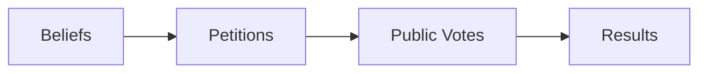
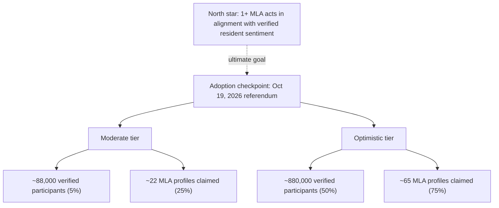
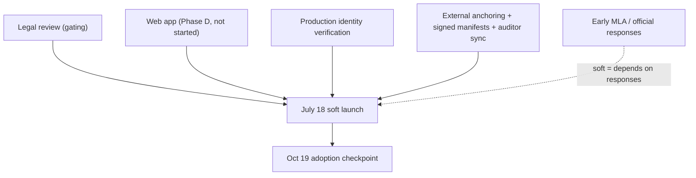

# OurSay — Product Requirements Document

*Alberta launch. Soft launch target **July 18, 2026**; adoption measured by the **October 19, 2026** provincial referendum.*

This document is the single agreed answer to four questions: what we are building, for whom, why now, and how we will know it worked. It is written for two audiences at once — the internal team that has to ship it, and the external stakeholders (council, MLAs, journalists, legal advisors) who need to understand and trust it. The Executive Summary below stands on its own for a stakeholder; the numbered sections add the detail the team needs.

It sits **above** the engineering documents, not beside them. Behavioural detail lives in `[01-CONTRIBUTOR-SPEC.md](01-CONTRIBUTOR-SPEC.md)`; implementation status lives in `[API-GAPS-AND-ROADMAP.md](API-GAPS-AND-ROADMAP.md)`; the trust model lives in `[05-TRUST-REVIEW.md](05-TRUST-REVIEW.md)`. This PRD links to them rather than restating them.

---


## Executive Summary

Representative democracy was built for a world without instant communication. Between elections, citizens have no verified, persistent, auditable way to tell their representatives what they actually think — and representatives have no trustworthy way to find out. Opinion polls can be commissioned for a conclusion. Online petitions cannot confirm a single signature is real. Social media rewards the loudest voice, not the most representative one.

**OurSay is civic infrastructure that closes that gap.** Albertans express political beliefs, sign petitions, and vote on public questions. Every result is public, broken down by district and by verification tier, and independently auditable — no one has to take OurSay's word for any number it publishes.

- **What ships:** A verified, auditable platform where Albertans participate in beliefs, petitions, and public votes, with identity verification and a public record anyone can audit.
- **Soft launch:** Alberta, **July 18, 2026**. Soft because it depends on completing a legal review and on early responses from officials.
- **Adoption deadline:** **October 19, 2026** — the Alberta fall referendum. This is when we measure whether enough Albertans and MLAs are using the platform.
- **The real measure of success:** At least one MLA votes or acts in alignment with the verified will of residents in their constituency as shown on OurSay. Adoption numbers matter only because they make that outcome possible.


|                       | Moderate target (by Oct 19)        | Optimistic target (by Oct 19)        |
| --------------------- | ---------------------------------- | ------------------------------------ |
| Verified participants | ~88,000 (5% of prior valid voters) | ~880,000 (50% of prior valid voters) |
| MLA profiles claimed  | ~22 (25% of 87)                    | ~65 (75% of 87)                      |


---


## 1. Background and context

OurSay launches in Alberta as its first deployment and is designed from the start to work for any democratic system anywhere (`[01-CONTRIBUTOR-SPEC.md](01-CONTRIBUTOR-SPEC.md)` §1). It is not a social network and not a polling service. It is a neutral civic tool: it carries no political agenda and treats all content equally by its mechanics.

The product organizes participation into a four-level hierarchy of escalating formality, where linkage between levels is always optional (`[01-CONTRIBUTOR-SPEC.md](01-CONTRIBUTOR-SPEC.md)` §8):




A **belief** is an informal statement others agree or disagree with. A **petition** is a formal call to action addressed to a named authority. A **public vote** is a formal question whose choices are final once cast. A **result** is the permanent, auditable outcome of a closed public vote. A result can be traced back through the votes, petitions, and beliefs that shaped it.

The defining feature is **verification**. Anyone can participate without verifying, and unverified participation counts and is publicly visible. Verified users have confirmed their identity and Alberta residency through a verification process, and their actions are distinguished by tier in every count and filter. The difference between "people who clicked a button" and "confirmed, identity-verified Alberta residents in a specific district" is what gives the platform its value, and OurSay makes that difference visible everywhere (`[02-PUBLIC-EXPLAINER.md](02-PUBLIC-EXPLAINER.md)`).

Why now: Alberta's debates over autonomy, federal relations, and resource policy are live and consequential, and the fall referendum on October 19, 2026 concentrates public attention on exactly the kind of question OurSay is built to measure. The referendum is the context for urgency, not the product itself.

---


## 2. Goals and success metrics

This section separates three things that are easy to conflate. **Impact** is whether the platform changed how democracy works. **Adoption** is whether enough people used it. **Launch requirements** (§2b) are the capabilities that must be live and trustworthy for the platform to launch at all — they are commitments, not metrics, and they are measured as done-or-not-done, never as a percentage.


| Category                  | Question it answers                                   | Measured when                                      |
| ------------------------- | ----------------------------------------------------- | -------------------------------------------------- |
| Impact (north star)       | Did the platform change democratic behaviour?         | Ongoing; highlighted through the referendum window |
| Adoption KPIs             | Did enough people and officials use it?               | By October 19, 2026                                |
| Launch requirements (§2b) | Is the product real and trustworthy enough to launch? | By July 18, 2026                                   |


### 2.1 Impact — the north star

**At least one MLA votes or acts in alignment with the verified will of residents in their constituency, based on data the platform makes public.** This is the outcome the entire product exists to produce. It is not date-bound and it is tracked qualitatively, through documented cases where an official's position or vote can be tied to the verified sentiment of residents in the constituency surfaced on OurSay. Every adoption target below exists only to make this outcome more likely.

### 2.2 Adoption KPIs — deadline October 19, 2026

The denominator is **1,760,605 valid ballots** cast in the 2023 Alberta provincial general election. The Legislative Assembly has **87 MLAs**. Targets are measured at the referendum date, not at soft launch.




| Tier       | Verified participants       | MLA profiles claimed |
| ---------- | --------------------------- | -------------------- |
| Moderate   | 5% of 1,760,605 (~88,000)   | 25% of 87 (~22)      |
| Optimistic | 50% of 1,760,605 (~880,000) | 75% of 87 (~65)      |


Notes on measurement:

- "Verified participants" counts users who have completed identity-and-residency verification, not raw account registrations. Unverified participation is welcome and counted separately, but it is not the adoption KPI.
- "MLA profiles claimed" counts officials who have claimed the auto-generated profile for their constituency (see §7.6 and `[01-CONTRIBUTOR-SPEC.md](01-CONTRIBUTOR-SPEC.md)` §4.5).
- Hitting a tier is a health signal, not the goal. A single MLA acting on the data (the north star) outranks any participant count.


### 2.b Launch requirements — deadline July 18, 2026

These must be **shipped and live** for the soft launch. They are stated as requirements, with public-facing language on the left and internal traceability on the right. None of them is a percentage.


| Requirement                         | What it means (stakeholder language)                                                                                                                                                                                         | Internal traceability                                                                                                 |
| ----------------------------------- | ---------------------------------------------------------------------------------------------------------------------------------------------------------------------------------------------------------------------------- | --------------------------------------------------------------------------------------------------------------------- |
| Identity verification in production | Verified users confirm their identity and Alberta residency through a real verification provider, paying only the direct cost.                                                                                               | `[01-CONTRIBUTOR-SPEC.md](01-CONTRIBUTOR-SPEC.md)` §3.3, §5; `[mvp-c-kyc-provider]`                                   |
| Full civic web app                  | An end-to-end web application for beliefs, petitions, and public votes — not a developer harness.                                                                                                                            | `[API-GAPS-AND-ROADMAP.md](API-GAPS-AND-ROADMAP.md)` Phase D                                                          |
| External anchoring                  | The public record's roots are published to more than one independent public infrastructure target that OurSay does not control, so anyone can verify integrity without trusting us (a test network is acceptable at launch). | `[PHILOSOPHY.md](PHILOSOPHY.md)` §6–7; `[API-GAPS-AND-ROADMAP.md](API-GAPS-AND-ROADMAP.md)` Phase E                   |
| Signed count manifests              | Published aggregate counts are signed by the platform, so a silent change to a number is detectable — not only recomputed live on each read.                                                                                 | `[API-GAPS-AND-ROADMAP.md](API-GAPS-AND-ROADMAP.md)` `[mvp-c13-signed-count-snapshots]`                               |
| Public record sync for auditors     | A full sync/stream of the public record for voluntary independent auditors, beyond the read endpoints the web app itself uses.                                                                                               | `[05-TRUST-REVIEW.md](05-TRUST-REVIEW.md)` §1; `[../public-record/REQUIREMENTS.md](../public-record/REQUIREMENTS.md)` |
| Settlement worker in production     | Civic actions are batched into tamper-evident settled blocks before anchoring.                                                                                                                                               | `[API-GAPS-AND-ROADMAP.md](API-GAPS-AND-ROADMAP.md)` Phase A4 (landed)                                                |
| Geographic and tier counts          | Every count is filterable by district and by verification tier.                                                                                                                                                              | `[API-GAPS-AND-ROADMAP.md](API-GAPS-AND-ROADMAP.md)` Phase C; `[REGION-MODEL.md](REGION-MODEL.md)`                    |


---


## 3. Non-goals

Explicitly out of scope for the July 18 soft launch. Listing these prevents the launch from sliding into a petition-procedure or legal-process product.

- **Statutory petition procedure.** OurSay petitions are a product feature, not a submission to Elections Alberta and not the *Citizen Initiative Act* process. The PRD does not replicate notice periods, application fees, sampling, or committee-referral mechanics. Where a launch feature ever needs a legal citation, it is added narrowly, not as the product's spine.
- **MLA profile-claim workflow at launch.** Auto-generated official profiles may exist (§7.6), but the claim flow is a fast-follow, not a July 18 blocker. It remains an adoption KPI for October 19.
- **Official responses to petitions and votes.** The on-record reply feature for officials is post-launch (`[01-CONTRIBUTOR-SPEC.md](01-CONTRIBUTOR-SPEC.md)` §8.2, §4.5).
- **Elections Alberta integration / electorally-validated tier.** This is the designed future path and a higher trust tier (`[01-CONTRIBUTOR-SPEC.md](01-CONTRIBUTOR-SPEC.md)` §4.6); it is not a launch dependency.
- **Sponsorship and verification waitlist flows.** Community sponsorship and the waitlist (`[01-CONTRIBUTOR-SPEC.md](01-CONTRIBUTOR-SPEC.md)` §5) are post-launch.
- **Multi-jurisdiction feed.** Alberta is the only deployment at launch; cross-jurisdiction membership and a unified feed are later (`[API-GAPS-AND-ROADMAP.md](API-GAPS-AND-ROADMAP.md)` `[mvp-c10-multi-jurisdiction]`).
- **Municipal and federal geographies.** Launch scope is Alberta provincial districts; ward and riding levels come later (`[03-OUTREACH-TEMPLATE.md](03-OUTREACH-TEMPLATE.md)`).
- **Implementation internals.** Cryptographic envelope formats, schemas, and signing details stay in the contributor spec and public-record docs.

---


## 4. Personas


| Persona                | Who they are                                         | What they need from OurSay                                                                                                     |
| ---------------------- | ---------------------------------------------------- | ------------------------------------------------------------------------------------------------------------------------------ |
| Verified resident      | An Albertan who has confirmed identity and residency | Express beliefs, sign petitions, vote, and see counts for their own district, with their verification reflected in totals      |
| Unverified participant | An account holder who has not verified               | Participate fully, with a clear and honest distinction from verified totals                                                    |
| Guest                  | Anyone browsing without an account                   | Read all public content, counts, and results; no action (`[01-CONTRIBUTOR-SPEC.md](01-CONTRIBUTOR-SPEC.md)` §4.1)              |
| MLA / public official  | An elected representative for a constituency         | See the verified sentiment of residents in their riding, broken down by tier; later, claim a profile and respond on the record |
| Journalist             | A reporter covering Alberta politics                 | Cite district-level verified counts the way they cite election results, with an audit path                                     |
| Independent auditor    | A technically capable third party                    | Reproduce any published count from the public record without trusting OurSay's servers                                         |


---


## 5. User stories

Grouped by persona. Each story maps to a feature requirement in §7.

**Verified resident**

- As a verified Alberta resident, I can verify my identity and residency once and have my tier reflected in every action I take.
- As a verified resident, I can create a belief and agree or disagree with others' beliefs, optionally anonymously.
- As a verified resident, I can sign a petition addressed to a named authority, optionally with a comment.
- As a verified resident, I can vote on a public vote, understanding that my vote is final once cast.
- As a verified resident, I can filter any count to my own district and see how verified residents there compare to the province.

**Unverified participant**

- As an unverified participant, I can do everything a verified user can do, and my participation is counted and displayed separately from verified totals so the distinction is never misleading. *This is a per jurisdiction rule. Unverified participants may be blocked from acting on a jurisdiction's verifiable record.*

**Guest**

- As a guest, I can read all public content, counts, and results without an account and without being tracked.

**MLA / public official**

- As an MLA, I can see what verified residents of my constituency think on a specific issue, broken down by verification tier, without commissioning a poll.
- As an MLA, I can (fast-follow) claim the auto-generated profile for my constituency.

**Journalist**

- As a journalist, I can pull district-level verified counts through the public read API and link readers to an audit reference.

**Independent auditor**

- As an auditor, I can obtain a full copy of the public record and recompute any published total offline, confirming the platform published the truth.

---


## 6. Product scope — July 18 soft launch

The launch scope is the **full civic participation flow**, end to end, not a read-only preview. The table states the requirement level for each capability and where the detail lives. "Launch requirement" items are the §2b commitments; "Must" items are necessary supporting capabilities; "Should" and "Won't (this launch)" set the boundary.


| Capability                                                 | Level                                 | Source                                                                                                             |
| ---------------------------------------------------------- | ------------------------------------- | ------------------------------------------------------------------------------------------------------------------ |
| Account registration, passkey auth, recovery               | Must                                  | `[api/README.md](../api/README.md)`; `[01-CONTRIBUTOR-SPEC.md](01-CONTRIBUTOR-SPEC.md)` §4                         |
| Per-thread civic signing (WebAuthn)                        | Must                                  | `[API-GAPS-AND-ROADMAP.md](API-GAPS-AND-ROADMAP.md)` Phase A (landed)                                              |
| Create / agree / disagree on beliefs                       | Must                                  | `[01-CONTRIBUTOR-SPEC.md](01-CONTRIBUTOR-SPEC.md)` §8.1                                                            |
| Create / sign petitions                                    | Must (one content type among several) | `[01-CONTRIBUTOR-SPEC.md](01-CONTRIBUTOR-SPEC.md)` §8.2                                                            |
| Create / vote on public votes                              | Must                                  | `[01-CONTRIBUTOR-SPEC.md](01-CONTRIBUTOR-SPEC.md)` §8.3                                                            |
| Public browse + geo/tier counts                            | Must                                  | `[API-GAPS-AND-ROADMAP.md](API-GAPS-AND-ROADMAP.md)` Phase C                                                       |
| Identity verification (production provider)                | Launch requirement                    | `[01-CONTRIBUTOR-SPEC.md](01-CONTRIBUTOR-SPEC.md)` §5; `[mvp-c-kyc-provider]`                                      |
| Full civic web app                                         | Launch requirement                    | `[API-GAPS-AND-ROADMAP.md](API-GAPS-AND-ROADMAP.md)` Phase D                                                       |
| External anchoring (more than one target; test network OK) | Launch requirement                    | `[PHILOSOPHY.md](PHILOSOPHY.md)` §6–7; Phase E                                                                     |
| Signed count manifests                                     | Launch requirement                    | `[mvp-c13-signed-count-snapshots]`                                                                                 |
| Public record sync/stream for auditors                     | Launch requirement                    | `[05-TRUST-REVIEW.md](05-TRUST-REVIEW.md)`; `[../public-record/REQUIREMENTS.md](../public-record/REQUIREMENTS.md)` |
| Settlement worker in production                            | Launch requirement                    | `[API-GAPS-AND-ROADMAP.md](API-GAPS-AND-ROADMAP.md)` Phase A4 (landed)                                             |
| Alberta jurisdiction + district catalog                    | Must                                  | Landed (`ab-ca-gov`)                                                                                               |
| Auto-generated official profiles (read-only)               | Should                                | `[01-CONTRIBUTOR-SPEC.md](01-CONTRIBUTOR-SPEC.md)` §4.5                                                            |
| MLA profile-claim workflow                                 | Won't (fast-follow; KPI by Oct 19)    | §3                                                                                                                 |
| Official responses to petitions/votes                      | Won't (this launch)                   | §3                                                                                                                 |
| Elections Alberta integration                              | Won't (roadmap)                       | §3                                                                                                                 |
| Sponsorship / verification waitlist                        | Won't (this launch)                   | §3                                                                                                                 |
| Formal derived `result` entities on poll close             | Should                                | `[mvp-c12-poll-results]`                                                                                           |


**Critical path.** The backend civic write path and public read API are largely landed (Phase A–C). The two largest gaps between today and "full civic flow on July 18" are the **web app** (Phase D, not yet started) and **production identity verification** (currently a dev stub). The launch plan should treat these as the schedule drivers; see §8.

---


## 7. Feature requirements

Requirements reference the contributor spec for behavioural detail rather than restating it. Each subsection lists what must be true for launch.

### 7.1 Beliefs

Any registered user can create a belief and can agree or disagree, optionally anonymously, and may change their position. Agree/disagree counts are shown as totals and broken down by verification tier. Beliefs do not expire. (`[01-CONTRIBUTOR-SPEC.md](01-CONTRIBUTOR-SPEC.md)` §8.1)

### 7.2 Petitions

Any registered user can create or sign a petition addressed to a named authority. A signer may add an optional comment, hidden when signing anonymously. Signatures are final by default; *This is a per jurisdiction rule. Other jurisdictions may allow revoking petition signatures.* Petitions are one content type among several — not the product's center of gravity. (`[01-CONTRIBUTOR-SPEC.md](01-CONTRIBUTOR-SPEC.md)` §8.2)

### 7.3 Public votes and results

Any registered user can vote on a public vote, optionally anonymously. **Votes are final once cast** by default. *This is a per jurisdiction rule. Other jurisdictions may allow changing votes.* Voting runs for a defined period; when it closes, a result can be generated. Vote counts are shown per option, as totals and by tier. A formal derived `result` entity at poll close is a Should for launch (`[API-GAPS-AND-ROADMAP.md](API-GAPS-AND-ROADMAP.md)` `[mvp-c12-poll-results]`); until it lands, closed-vote outcomes are presented honestly as live recomputed counts. (`[01-CONTRIBUTOR-SPEC.md](01-CONTRIBUTOR-SPEC.md)` §8.3–8.4)

### 7.4 Identity and verification

Verification is pluggable per jurisdiction; the Alberta launch uses a commercial provider (Equifax Connect preferred) that confirms identity, age, and address from public records (`[01-CONTRIBUTOR-SPEC.md](01-CONTRIBUTOR-SPEC.md)` §3.3, §5). Tiers map from provider output: identity confirmed → identity verified; identity + address → residency verified (`[01-CONTRIBUTOR-SPEC.md](01-CONTRIBUTOR-SPEC.md)` §4.3–4.4, §5.2). The user reviews and consents to the exact, at-cost price before paying (`[02-PUBLIC-EXPLAINER.md](02-PUBLIC-EXPLAINER.md)`). Residency verification confirms a real person at a verified address; it is explicitly **not** a determination of electoral eligibility, voter registration, or citizenship, and the platform makes no such claim. An electoral-authority integration (electorally-validated tier) is the designed future path, not a launch requirement (`[01-CONTRIBUTOR-SPEC.md](01-CONTRIBUTOR-SPEC.md)` §4.6).

### 7.5 Geography and public counts

District membership is **inferred from the user's verified address at query time, never stored as a binding on the user** (`[01-CONTRIBUTOR-SPEC.md](01-CONTRIBUTOR-SPEC.md)` §6.3; `[REGION-MODEL.md](REGION-MODEL.md)`). Every aggregate count is filterable by area, verification tier, and date range, and the filters are combinable (`[01-CONTRIBUTOR-SPEC.md](01-CONTRIBUTOR-SPEC.md)` §6.4). Narrow geographic or tier buckets are suppressed below a k-anonymity floor to protect privacy (`[API-GAPS-AND-ROADMAP.md](API-GAPS-AND-ROADMAP.md)` Phase C; `[06-PRIVACY-REVIEW.md](06-PRIVACY-REVIEW.md)`). A read-only public API exposes counts, district definitions, results, and audit references, with no PII and no rate limiting that would block legitimate audit or research use (`[01-CONTRIBUTOR-SPEC.md](01-CONTRIBUTOR-SPEC.md)` §7).

### 7.6 Official / MLA experience

At launch, officials may have auto-generated, read-only profiles built from public record, each carrying the disclaimer that the official has not endorsed the platform and may be unaware of the profile (`[01-CONTRIBUTOR-SPEC.md](01-CONTRIBUTOR-SPEC.md)` §4.5). The MLA value proposition is to see the verified sentiment of residents in their riding, by tier, without a commissioned poll (`[03-OUTREACH-TEMPLATE.md](03-OUTREACH-TEMPLATE.md)`). The profile-claim workflow and on-record official responses are fast-follow, not launch blockers (§3).

### 7.7 Auditability and transparency

The platform makes two separate promises and never conflates them (`[05-TRUST-REVIEW.md](05-TRUST-REVIEW.md)` §1):

1. **Trustless — verifiable without us.** Record integrity and the anonymized signed record are independently auditable. Actions are stored as salted content commitments, linked in per-entity hash chains, rolled into roots, anchored to external public infrastructure, and checkable by an offline verifier against an independently obtained root. The platform signs an attestation over the published verified set.
2. **The one honest trust gap.** That a given verified action belongs to a specific district rests today on OurSay plus the verification provider. The platform states this plainly and does not over-claim; the roadmap to shrink it (electoral-authority integration, multi-provider signatures, independent validators) is documented in the trust review.

For launch this means: external anchoring to more than one independent target, signed count manifests, and a full public record sync for voluntary auditors must be live (§2b), and public-facing copy must describe closed-vote numbers honestly (signed snapshot where available, otherwise live recompute).

---


## 8. Dependencies and risks




| Dependency / risk                                  | Impact                                                                   | Status / mitigation                                                           |
| -------------------------------------------------- | ------------------------------------------------------------------------ | ----------------------------------------------------------------------------- |
| Legal review                                       | Gating — "soft" launch is contingent on completing it                    | Scope to be confirmed (§10); flag as the launch go/no-go in planning          |
| Web app (Phase D)                                  | Largest build gap; no product UI exists today (`/walk` is a dev harness) | Treat as the primary schedule driver; scope to the full civic flow only       |
| Production identity verification                   | Verified tier is meaningless without it; currently a dev stub            | Integrate the commercial provider; confirm cost-display and consent flow      |
| External anchoring, signed manifests, auditor sync | Trust claims depend on them                                              | Test network acceptable at launch; ensure honest public copy until fully live |
| Early official engagement                          | Soft launch and the north star both depend on it                         | Outreach in parallel; MLA profile-claim is fast-follow, not a blocker         |
| Over-claiming residency attribution                | Credibility and legal exposure                                           | Hold all copy to the trust review's two-promise line (§7.7)                   |
| Petition-procedure scope creep                     | Distracts from the platform mission                                      | Non-goals (§3) keep statutory process out of launch                           |


---


## 9. Timeline and milestones

```text
Now (backend largely Phase A–C landed)
  -> Phase D: full civic web app
  -> Production identity verification
  -> Phase E: external anchoring, signed manifests, auditor sync, production deploy
  -> Jul 18, 2026: soft launch (all §2b launch requirements met; legal review complete)
  -> Oct 19, 2026: adoption checkpoint (Alberta fall referendum) — measure KPIs
```


| Milestone           | Date             | Definition of done                                                                          |
| ------------------- | ---------------- | ------------------------------------------------------------------------------------------- |
| Soft launch         | July 18, 2026    | Every §2b launch requirement live; legal review complete; full civic flow usable end to end |
| Adoption checkpoint | October 19, 2026 | Adoption KPIs (§2.2) measured; north-star cases (§2.1) tracked                              |


Internal phase tags (Phase A–E, `[mvp-*]`) are traceability to `[MVP-PROMPTS.md](../.agents/MVP-PROMPTS.md)` and `[API-GAPS-AND-ROADMAP.md](API-GAPS-AND-ROADMAP.md)`; they are not part of the stakeholder narrative.

---


## 10. Open questions

These need a decision before or during the build. Defaults are noted where the team can proceed without blocking.

1. **Soft-launch definition.** Is July 18 a public marketing launch or a limited/invite-only beta (for example, MLAs and early communities first)? *Default: public site with reduced marketing until adoption and trust features are proven.*
2. **Legal review scope.** What specific question is the legal review answering (for example, third-party advertising obligations during the referendum window per `[04-LEGAL-OUTREACH.md](04-LEGAL-OUTREACH.md)`), and what is the go/no-go criterion? *Needed to make §8 precise.*
3. **Production deploy and published build hashes.** Is a production deployment with a published, anchored build hash (`[01-CONTRIBUTOR-SPEC.md](01-CONTRIBUTOR-SPEC.md)` §3.5) an explicit July 18 blocker, or implied by "external anchoring"? *Default: treat as part of the launch requirement set.*
4. **Verification pricing at launch.** Is at-cost user-paid verification live on day one, or is a stubbed/limited path acceptable for the soft launch? *Default: at-cost user-paid, since the verified tier is a launch requirement.*
5. **Seed content.** Who creates the initial beliefs, petitions, and public votes so the platform is not empty on launch day?
6. **Accessibility target.** What WCAG level does the web app commit to for launch?

---


## Appendix A — Traceability to engineering documents


| PRD area                                               | Engineering source                                                                                                                 |
| ------------------------------------------------------ | ---------------------------------------------------------------------------------------------------------------------------------- |
| Vision, principles, content model, tiers, verification | `[01-CONTRIBUTOR-SPEC.md](01-CONTRIBUTOR-SPEC.md)` §1–8                                                                            |
| Geographic model, filtering, public API                | `[01-CONTRIBUTOR-SPEC.md](01-CONTRIBUTOR-SPEC.md)` §6–7; `[REGION-MODEL.md](REGION-MODEL.md)`                                      |
| Shipped vs gaps, phase tags, launch-blocker status     | `[API-GAPS-AND-ROADMAP.md](API-GAPS-AND-ROADMAP.md)`                                                                               |
| Trust model, two-promise line, audit story             | `[05-TRUST-REVIEW.md](05-TRUST-REVIEW.md)`                                                                                         |
| Privacy, disclosure, k-anonymity                       | `[06-PRIVACY-REVIEW.md](06-PRIVACY-REVIEW.md)`                                                                                     |
| Public language rules, anchoring vocabulary            | `[PHILOSOPHY.md](PHILOSOPHY.md)` §7; `[01-CONTRIBUTOR-SPEC.md](01-CONTRIBUTOR-SPEC.md)` §3.4                                       |
| Public record, settlement, anchoring requirements      | `[../public-record/REQUIREMENTS.md](../public-record/REQUIREMENTS.md)`, `[../public-record/README.md](../public-record/README.md)` |
| Account API surface                                    | `[api/README.md](../api/README.md)`                                                                                                |
| Identity and device policy                             | `[08-IDENTITY-AND-DEVICE-POLICY.md](08-IDENTITY-AND-DEVICE-POLICY.md)`                                                             |
| Formal domain objects (attributes, states, invariants) | `[entities/README.md](entities/README.md)`                                                                                         |


## Appendix B — Glossary

Product and platform vocabulary (belief, petition, public vote, result, district, jurisdiction, verification tier) is defined in `[GLOSSARY.md](GLOSSARY.md)`.