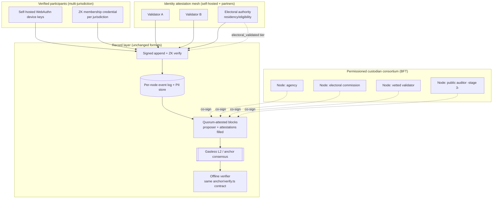

# OurSay Platform Audit — Assumed Future State (3–5 years)

**Assumed date:** ~2030 · **Premise:** the product vision in `.agents/AUDIT-PROMPT.md` is largely realized. Written 2026-07-06 against repo commit `df80f4a`; this is a *forward projection* tied to existing seams, not a description of shipped code. Where a claim depends on something that does not yet exist, it is labeled **[projected]** and anchored to the code/doc seam that makes it reachable. Companion: [`2026-07-PLATFORM-AUDIT.md`](./2026-07-PLATFORM-AUDIT.md).

> **Premise, stated concretely.** Multi-jurisdiction deployment across Canada; elected officials active on-platform; petitions graduating to polls to referendums; the vendor seams (Didit, Geocodio, Postmark, third-party passkey/custody) replaced by self-hosted equivalents; a permissioned consortium of custodians (agencies, electoral commissions, vetted identity validators) co-signing blocks; a gasless L2 (or equivalent) plus operator-run nodes carrying anchoring and consensus; and integrity strong enough that *online ballots in federal elections become conceivable* — which makes OurSay a first-tier target for foreign interference.

---

## Technical story

By this horizon OurSay is no longer "one operator with a verifiable database." It is a **permissioned-consortium civic record** whose stage-1 architecture (single custodian, event-sourced, content-addressed, per-entity chained, `chainId`-partitioned) has been *generalized, not rewritten* — exactly the leap [`07-DECENTRALIZATION-ALIGNMENT.md`](../07-DECENTRALIZATION-ALIGNMENT.md) was written to keep cheap. The block header's reserved `proposer` + `attestations` fields, empty in 2026, now carry a **custodian quorum's BFT signatures**; "the platform signs" has become "a quorum signs" with no change to the envelope, commitment, Merkle, or offline-verifier formats. Wall-clock time is still metadata; canonical order is still structural (block height + position), so independent nodes agree deterministically.

"Election-adjacent" here means a specific, bounded thing: OurSay can host a **referendum whose result is a signed, quorum-attested, externally-anchored record that any citizen can recompute offline and against which each participant can verify their own submitted action** (self-audit receipts, R10, generalized to `revealThread`/selective-reveal R11). It is *adjacent* to elections — an auditable parallel record with cryptographic receipts — and, at the strongest tier, can carry an **electoral-authority residency attestation** (`electoral_validated`) that finally closes the one trust gap the 2026 system could not. It is **not**, by default, the ballot of record: ballot secrecy, coercion-resistance, and legal certification are a higher bar addressed explicitly below.

The stack is self-hosted at every seam that used to be a vendor: identity verification is a **multi-provider attestation mesh** (several independent verifiers sign attestations; a user verified by several is more strongly verified than one — R27); geocoding and boundary geometry are **self-hosted** (the reserved Nominatim slot realized, own boundary registry); mail is **sovereign**; device custody is **self-hosted WebAuthn** with no third-party custodian (the Turnkey experiment stays retired, per `turnkey-test/FINDINGS.md`). Trustless dedupe is on its designed path toward **ZK membership credentials (Method 4)**, with the envelope's reserved `proof` slot and `nullifier_attestations.membership_proof` finally carrying real proofs instead of platform signatures.

---

## Future system map

**Flows that change vs. 2026.**
- **Consensus replaces single-writer.** Blocks are *proposed* by one node and *attested* by a quorum; finality is deterministic (a closed civic vote must never reorg — `07` §6). The per-entity `prevHash` chain still verifies per node; the single-sequential-writer assumption is replaced by BFT ordering.
- **Anchoring is live and plural.** Roots publish to a gasless L2 *and* a transparency log simultaneously (R15 pluggable, multi-target), so no single venue is a trust chokepoint. The offline verifier fetches roots from infra no operator controls.
- **Dedupe migrates from trust to proof.** Where 2026 used a platform-signed nullifier attestation, the mature system verifies a **ZK proof of unique membership per poll** — observers check proofs and nullifier sets, not "the platform says so" (`08` §5.5).
- **Residency becomes trustless at the top tier.** `electoral_validated` carries an electoral authority's attestation; geo-filtered counts at that tier are independently checkable, closing the 2026 headline gap.

---

## Residual trust boundaries

Even in the ideal architecture, some trust cannot be engineered away — naming it is the point.

1. **Issuer trust survives ZK.** ZK removes the *platform* as the dedupe bottleneck, but "one human, one credential" still rests on the identity issuers (the mesh + electoral authority). ZK proves *membership and uniqueness within an issued set*; it does not prove the set was issued to distinct real humans. `08` §5.5 says this plainly ("issuer trust… remains"). A colluding-issuer or compromised-electoral-authority scenario is the irreducible root.
2. **The identity-mesh quorum.** Multi-provider raises the cost of fake verification but a *majority of coerced/colluding validators* can still mint fake-but-verified members. Security is now a function of validator diversity and independence, not a single vendor — better, not absolute.
3. **The consensus quorum (Byzantine bound).** BFT tolerates up to *f* of *3f+1* malicious nodes; above that, the record can be forked or censored. Who holds the *3f+1* seats, and how independent they truly are (jurisdiction, infrastructure, legal exposure), is the security parameter.
4. **Anchor infrastructure.** "Infra we don't control" still has *its own* trust model (an L2's sequencer, a transparency log's operator). Plural simultaneous targets mitigate but do not eliminate; a global reorg or coordinated censorship across all targets is the tail risk.
5. **The endpoint.** Every proof assumes the user's *device* is honest and uncompromised. Malware, a coerced unlock, or a supply-chain-tampered authenticator defeats client-side signing regardless of how good the record is. This is where "conceivable federal online ballot" meets its hardest wall.
6. **Ballot secrecy vs. auditability.** The record's whole value is public verifiability; a secret ballot's whole value is that *no one* can prove how you voted. These are in genuine tension. The self-audit receipt that lets *you* verify your vote is also a **coercion/vote-buying receipt** if a coercer can demand it. Resolving this (e.g. receipt-free or everlasting-privacy voting schemes) is a research-grade problem, not a config change.

---

## Foreign interference playbook

What a well-resourced nation-state (threat tier 4: ISP/carrier cooperation, lawful intercept, supply-chain, long-horizon ops) would try, and what the mature architecture can and cannot stop.

| Target | Attack | Can OurSay stop it? |
|---|---|---|
| **Identity mesh** | Stand up or coerce validators; buy/farm credentials at scale to seat fake "verified residents" | **Partially.** Multi-provider + electoral-authority attestation raises cost sharply; ZK doesn't help (issuer-trust residual). Requires diverse, independently-governed issuers and anomaly detection. The irreducible risk. |
| **Consensus quorum** | Compromise/coerce ≥ *f+1* custodian nodes to censor or fork a referendum | **Up to the BFT bound.** Deterministic finality prevents reorg *below* the bound; validator diversity and on-record admission (`07` §6) are the defense. Above the bound, integrity fails — so seat composition is a national-security decision, not an ops one. |
| **Anchor layer** | Censor publication or reorg across anchor targets | **Mostly.** Plural simultaneous targets + old-copy retention (anyone holding a prior bundle detects withheld history) make silent rewrite hard; total cross-target censorship is the tail. |
| **Endpoint / supply chain** | Malware, tampered authenticators, coerced unlocks to forge or observe votes | **No, not in software alone.** Hardware-backed non-exportable keys + UV-per-action raise cost; a compromised device still wins. This caps any "online federal ballot" claim. |
| **Carrier / network** | Intercept OTP, correlate metadata, block access during a vote | **Partially.** Passkey-first (OTP not a standing factor) blunts interception; metadata correlation and availability-denial during a vote window are real and need network-layer + legal countermeasures. |
| **Legal coercion** | Compel a custodian to alter/reveal records or halt a vote | **By design, limited blast radius.** No single custodian is the source of truth; PII is compartmentalized per jurisdiction with no shared parent (`06` §3a), so compelling one body cannot reconstruct cross-jurisdiction identity or unilaterally rewrite the record. Compelling a *quorum* across jurisdictions is the residual. |
| **Re-identification** | Deanonymize dissenters via behavioural + cross-level geographic inference | **Partially.** k-anon, coarse geography, per-jurisdiction key separation, and default anonymity help; maximally-public heavy users remain inferable (`06` §2) — a permanent UX/consent problem, not a crypto one. |

**What fails silently (the things to instrument now):** coerced-issuer approvals (the record looks valid), a quorum quietly at the edge of its Byzantine bound, and anchor-publication gaps. The mature system must treat *issuance-rate anomalies*, *validator-set changes*, and *anchor cadence* as first-class monitored, on-record signals — because none of them break a hash, and the offline verifier by construction only checks hashes.

---

## Election-grade security bar

Explicit criteria that must ALL hold before OurSay may claim **federal online-ballot integrity** — distinct from what it can already claim as an **auditable civic referendum record**.

| Requirement | Auditable civic referendum record (reachable P0–P2) | Federal online-ballot grade (research + institutional) |
|---|---|---|
| **Record integrity** | ✅ external anchor + offline verifier | ✅ same, plus BFT quorum finality, no reorg |
| **Result recomputability** | ✅ anyone recomputes offline | ✅ same |
| **Self-audit receipt** | ✅ voter verifies own action (R10/R11) | ⚠️ must become **coercion-resistant / receipt-free** (secrecy vs. audit tension) |
| **Distinct real voters (dedupe)** | ⚠️ platform/ZK + issuer trust | ✅ trustless dedupe **and** an accountable eligibility authority |
| **Residency/eligibility** | ⚠️ provider/self-attested (not trustless) | ✅ **electoral authority is the issuer**, independently checkable |
| **Ballot secrecy** | ❌ record is public by design | ✅ everlasting privacy / receipt-freeness required |
| **Coercion & vote-buying resistance** | ❌ receipt is a coercion tool | ✅ required (re-voting, receipt-freeness, or in-person fallback) |
| **Endpoint integrity** | ❌ trusts the device | ✅ needs hardened clients / attestation / risk-limiting fallback |
| **Independent operation** | ⚠️ consortium | ✅ genuinely independent, jurisdiction-diverse quorum + public observers |
| **Certification & risk-limiting audit** | ❌ not certified | ✅ statutory certification + RLA processes |

The load-bearing distinction OurSay must never blur: **"you can verify the record was not tampered with and recompute the totals" is achievable and valuable; "this is a secret, coercion-resistant, certified federal ballot" is a different, far harder claim** requiring ballot-secrecy cryptography, endpoint assurance, and institutional/legal certification OurSay cannot grant itself. The architecture should keep the *former* honest and the *latter* clearly gated behind criteria it does not yet meet — the same discipline `05-TRUST-REVIEW.md` applies today.

---

## Findings by lens (risks that emerge at scale)

1. **Cryptographic integrity — [Medium].** Formats survive the leap unchanged, which is the design win; the new risk is **quorum/anchor liveness and reorg pressure** on high-stakes closes. Deterministic finality is mandatory (a referendum must not reorg); the age trigger must stay *cadence-only* even under consensus (`07` §5), or ordering becomes clock-dependent.
2. **Identity & authentication — [High].** At scale the mesh's *independence* is the whole ballgame; a monoculture of validators (same infra, same jurisdiction, same corporate parent) recreates the single-provider risk under a plural veneer. Governance of validator admission (on-record, `07` §6) must resist capture.
3. **Verification & KYC — [High].** ZK removes platform-dedupe trust but not issuer trust; the residual is a coerced/colluding issuer minting verified fakes that no proof can catch. Needs cross-issuer corroboration and issuance-rate anomaly detection as monitored signals.
4. **Geographic attribution — [Medium, much improved].** `electoral_validated` closes the trustless-residency gap *for that tier*; lower tiers still carry the 2026 gap, so **mixed-tier counts must never be presented as uniformly trustless**. Boundary redraws still leak triangulation data over time.
5. **Write model & authorization — [Medium].** Cross-jurisdiction officials, graduation automation, and more record types widen the governance surface; per-entity + per-jurisdiction rule composition must stay deterministic and reproducible across nodes (no node-local policy).
6. **Privacy & re-identification — [High].** The *same public record that enables audit* is the permanent re-identification substrate for maximally-public users; at national scale with officials watching, this is a chilling-effect and targeting risk. Ballot-secrecy tension (above) is the acute version.
7. **Availability & abuse — [High].** A federal-adjacent vote window is a prime DDoS / carrier-block / liveness-attack target; consortium HA, multi-region, and graceful degradation (with a verifiable fallback) become mandatory, not optional.
8. **Operational security — [High].** Many custodians and issuers = many key-holders and larger insider/coercion surface; per-purpose KMS/HSM keys, audited issuance, and compartmentalized PII (already designed, `06` §3a) must be enforced org-wide, not per-node discretion.
9. **Governance & decentralization — [High].** Stage 3 (public nodes) only unlocks behind the `07` §6 gates (Sybil-resistant admission, BFT, stake/reputation, on-record membership). Opening too early *weakens* the guarantees; the gating must remain evidence-based, not calendar-driven.
10. **Legal & regulatory — [High].** The stronger the integrity, the greater the temptation to over-claim electoral status; the non-affiliation / not-eligibility discipline must scale with capability, and any electoral-authority integration must be contractual and disclosed, never implied.
11. **Foreign interference — [Critical].** Everything above converges here: the system is only as strong as its *least independent* quorum/issuer seat and its *most compromised* endpoint. The mature design's honest ceiling is "auditable, hard-to-rewrite, hard-to-forge at scale," not "unbreakable."

---

## Strengths at scale

- **The format-stability bet pays off.** Because 2026 kept the record model consensus-ready (reserved attestations, `chainId` scoping, structural ordering, node-agnostic external trust root), the consortium and public-node stages are *operator/quorum changes, not rewrites* — the offline verifier contract (`anchor/verify.ts`) is unchanged, so every historical proof still verifies. This is the single most valuable thing the current codebase does for its future.
- **Trust is compartmentalized by construction.** Per-jurisdiction masters with no shared parent (`06` §3a) mean scale does not create a single honeypot; compelling or breaching one jurisdiction's custodian does not unlock the others.
- **Auditability is external and plural.** Multi-target anchoring + old-copy retention makes silent historical rewrite genuinely hard at scale — censorship becomes *detectable*, which is the property that matters for a civic record.
- **The trust ledger is honest.** The codebase's habit of naming residual trust (Trust Review, Values §2, the `08` "honest limits") scales into an institution that can tell the public *exactly* what is and isn't guaranteed — the prerequisite for legitimacy in anything election-adjacent.

---

## Path from current → future

Tying back to the P0/P1/P2 roadmap in the current-state audit:

- **P0 (pre-Oct-2026) is the foundation the entire future rests on.** External anchoring, KMS-held keys, PII-at-rest encryption, verified-account recovery, and server-side visibility enforcement are not just current-state fixes — they are the *stage-1-done-right* baseline without which stages 2–3 inherit unfixable debt. In particular, **external anchoring must ship first**: it is the trust root the consortium and public nodes will agree against.
- **P1 builds the plurality.** Multi-provider KYC with signed attestations (R27), self-hosted vendor replacements, and the custodian quorum (fill `proposer`/`attestations`) convert single points into diverse sets. This is where "don't trust *us*" becomes "don't trust *any one node*."
- **P2 reaches for trustlessness.** Electoral-authority residency (`electoral_validated`), ZK dedupe (Method 4, using the already-reserved `proof` slot), and public-node BFT (stage 3, gated by `07` §6) remove the last platform-trust slots — *for the properties they cover*. Ballot secrecy, coercion resistance, endpoint assurance, and legal certification remain a **separate, research-and-institution track** that no amount of record-layer work completes on its own.

The bridge, in one sentence: **2026's discipline — keep the record model decentralization-ready and be honest about residual trust — is exactly what makes the 2030 consortium reachable without a rewrite, and exactly what will keep OurSay from over-claiming election-grade status before it has earned it.**
