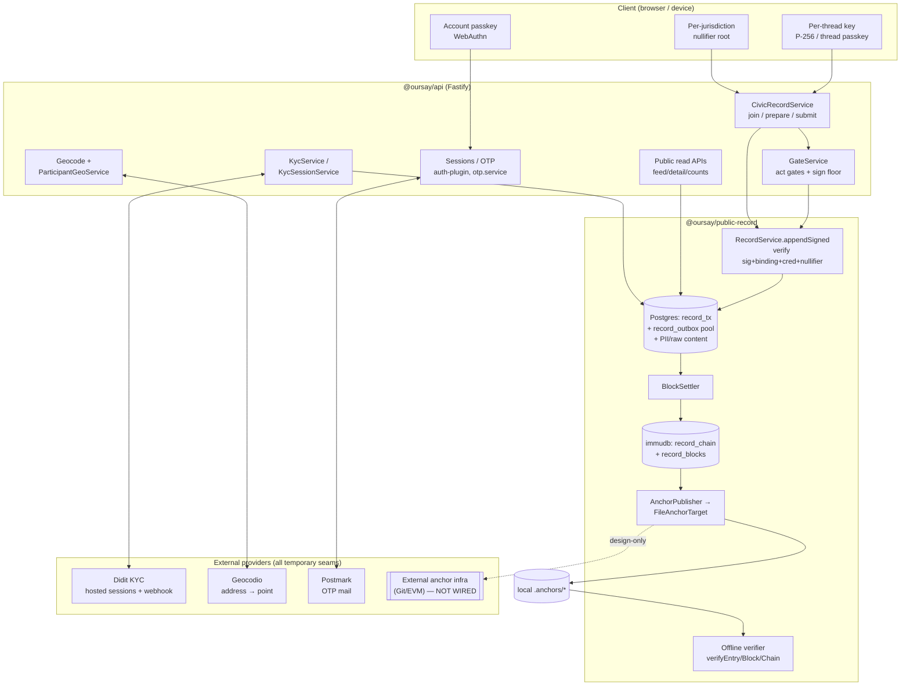

# OurSay Platform Audit — Current State

**Date:** 2026-07-06 · **Auditor:** Security architecture review (Claude, senior-security-architect brief) · **Repo commit:** `df80f4a7f90d26c47f7634db3d4885351c01c364` (branch `claude/fable-bridge`)

> Scope: an honest, evidence-grounded audit of OurSay **as if it were already a production civic system**, while marking plainly what is implemented, designed-but-unwired, or aspirational. Every finding cites a file, function, or doc section. Companion: [`2026-07-FUTURE-STATE-AUDIT.md`](./2026-07-FUTURE-STATE-AUDIT.md).
>
> **Runtime context at audit time (dev/integration, not production hardening).** A local stack was up: API on `127.0.0.1:6173` (`KYC_PROVIDER=didit`, Didit session-create + webhook award verified live); an ngrok tunnel (`https://<ngrok-subdomain>.ngrok-free.dev → :6173`) for Didit webhooks; Docker `public-record` stack (`oursay-public-record-pg` Postgres/PostGIS `:5442`, `oursay-public-record-immudb` immudb 1.11.0 pg-wire `:5443`, console `:8082`). This is dev context; risks specific to it are called out in §Threat scenarios and §Findings (OpSec).

---

## Executive summary

OurSay is an open-source civic-engagement platform whose central promise is unusually disciplined: it separates **"the record's integrity is auditable without trusting us"** from **"a given action belongs to a resident of riding X"**, and it is candid — in [`docs/05-TRUST-REVIEW.md`](../05-TRUST-REVIEW.md) and [`docs/VALUES.md`](../VALUES.md) — that only the first is trustless and the second still rests on the platform plus a KYC provider. That candor is itself a security asset: the most common failure mode for civic-tech ("we put it on a blockchain, therefore trust us") is explicitly ruled out in the docs and, largely, in the code.

The engineering is materially more advanced than "pre-MVP." The civic write path is real cryptography, not a stub: every append is a per-thread P-256 or WebAuthn-ES256 signature verified server-side against a private platform registration binding, a per-device credential attestation, a nullifier dedupe check, an envelope-freshness gate, and a per-jurisdiction signing floor (`public-record/src/record.ts` `appendSigned`, wired through `api/src/services/civic-record.service.ts`). The offline verifier is genuinely offline and pure — it recomputes salted commitments, Merkle proofs, and a cumulative chain-tip fold from a published bundle and an independently obtained root, touching no database (`public-record/src/anchor/verify.ts`). Account auth is hygienic: opaque peppered session tokens (only the hash is stored), hashed+salted+peppered OTPs, per-email/per-IP rate limits, no account enumeration on recovery or gated cross-device login, and WebAuthn user-verification forced on in production.

**The single largest gap between promise and reality is external anchoring: it is not wired.** The only implemented `AnchorTarget` writes append-only *local files* (`FileAnchorTarget`), so today the trust root is still the operator's own immudb root and local anchor directory. Until roots are published to infrastructure OurSay does not control (Git transparency log / EVM / etc.), "verify without trusting us" is a design guarantee, not a live one — a fact the docs state plainly (`public-record/README.md`, [`05-TRUST-REVIEW.md`](../05-TRUST-REVIEW.md) §5) but which any external claim must not outrun.

**Top 5 risks (current state).**
1. **External anchoring unwired (High).** The trust-root promise is not yet operative; the file-target verifier proves the pipeline, not third-party verifiability.
2. **Geographic/residency attribution is platform-asserted (High).** `attestPlatformResidency` awards `residency_verified` from a geocoded point falling inside the jurisdiction; with the default stub geocoder this is entirely self-asserted, and even the Didit-POA path trusts one provider. No third party can check "resides in riding X."
3. **Single platform signing key, no KMS/rotation/quorum (High).** One P-256 key (`PLATFORM_BINDING_PRIVKEY`) signs registration bindings, nullifier attestations, and credential authorizations. Its compromise forges verified personas and dedupe attestations wholesale. Dev fallback is a hardcoded insecure scalar.
4. **Single KYC provider, unsigned attestation rows (Medium-High).** Didit is the sole verifier; `public.kyc_attestations` rows are platform-trust (R26) with no provider signature (R27 deferred), so the platform can assert any tier for any user, and Sybil-resistance reduces entirely to Didit's deduplication.
5. **PII-at-rest encryption / KMS (Medium — narrowed).** Thread-binding salts / openings still need encrypt-at-rest. Legal name / street address are **not** retained on OurSay (KYC-held). Geocode **points** are stored for GIS; column-level encryption of `geom` is **likely incompatible** with PostGIS GiST / `ST_Contains` — see `docs/entities/account/profile-geocode.md`. Harden with volume/disk encryption + access control.

**Top 5 strengths.**
1. **Real signed write path with defense-in-depth** (`appendSigned`): signature + binding re-verify + credential attestation + nullifier dedupe + freshness + jurisdiction floor, all fail-closed.
2. **A true offline verifier** consuming only published data + an external root (`anchor/verify.ts`), with salted hiding commitments and domain separation throughout.
3. **Consensus-ready record model**: block header reserves `proposer`/`attestations`, chains are partitioned by `chainId`, and wall-clock time is metadata (age trigger is cadence-only, never ordering) — aligned with [`07-DECENTRALIZATION-ALIGNMENT.md`](../07-DECENTRALIZATION-ALIGNMENT.md).
4. **Auth and secrets hygiene**: peppered/hashed tokens and OTPs, no enumeration, gated login, recovery revokes all sessions, `secret()` fails loud in production, `.gitignore` blocks `*.key`/`*credentials*.json`/`.env` (the Turnkey key file is untracked, verified).
5. **Privacy architecture**: per-thread personas with no cross-thread correlator on the record, k-anonymity suppression and tier-gating on public counts, and identity surfaces designed to 404 (hide existence) out of scope.

The platform is a credible *auditable civic record* today. It is **not** an election-grade system, and nothing in the code claims to be. The gap to the Elections-Alberta-adjacent October 2026 milestone is dominated by one prerequisite (external anchoring) plus honest scoping of what "auditable receipt" means versus "certified ballot."

---

## System map

**Primary data flows.**
- **Civic write.** Client joins a thread (`CivicRecordService.join` → platform-signed binding + credential row), calls `prepare` for server-derived fields, signs a canonical `TxEnvelope`, and `submit`s it. `appendSigned` re-verifies everything and *pools* the commitment in Postgres (`record_outbox`); nothing hits immudb on the user's action. A `BlockSettler` cuts a block on a count/age trigger, batch-committing commitments + a `(chainId, height)` header to immudb; the `AnchorPublisher` replicates settled blocks to a target on its own cadence.
- **Account auth.** Email-OTP bootstrap/recovery/gated-login (Postmark/SMTP/SES/noop) and WebAuthn passkeys are the day-to-day factor; sessions are opaque DB tokens (`auth.sessions`, hash-only).
- **Verification.** `KycSessionService` starts Didit hosted sessions and awards a tier on webhook/poll approval into `public.kyc_attestations`; `attestPlatformResidency` self-awards `residency_verified` when the user's private geocoded point falls inside the jurisdiction.
- **Public read.** Unauthenticated feed/detail/counts read Postgres fold-on-read views; geo/tier filters apply k-anonymity suppression and per-jurisdiction count-exposure policy.

---

## Findings by lens

Severity: **Critical / High / Medium / Low / Informational**. Each finding notes whether it is *Implemented today*, *Designed but not wired*, or *Aspirational*.

### 1. Cryptographic integrity

**Strengths (Implemented today).**
- Salted, hiding content commitments with mandatory 32-byte salt and domain separation (`crypto/commitment.ts` `contentCommitment`, `CONTENT_DOMAIN`); a single canonical JSON serializer is used by producers and verifiers (`canonicalJson`) — no hand-serialization.
- A genuine **offline verifier** (`anchor/verify.ts`): `verifyEntry` re-hashes the leaf, checks the Merkle inclusion proof against an independently obtained root, and re-derives revealed content against its commitment; `verifyChain` walks the cumulative `chainTipHash` fold and binds to an expected `chainId` so an auditor cannot be fed another chain's anchors. Pure functions, no DB.
- Per-entity hash chains (`prevHash`) plus RFC-6962 Merkle roots per block; block header carries `bundleMerkleRoot`, `immudbRoot`, `prevBlockRoot`, `prevChainTipHash`, and `prevAnchorHash`.

**Findings.**
- **[High · Designed but not wired] External anchoring is absent.** The only `AnchorTarget` is `FileAnchorTarget` (local files); Git/EVM/Solana connectors "do not ship yet" (`public-record/README.md` "What does not ship yet"). Consequence: today the effective trust root is the operator's immudb root and local `.anchors/` directory. `R14`/`R16` ("verify without trusting the platform") are not yet operative. *Remediation:* implement and exercise at least one external target (a Git transparency log is the cheapest credible first step) and publish roots on a fixed cadence; only then may any "independently verifiable" claim be made in public copy.
- **[Medium · Implemented] immudb `verifyRow` is server-side.** Acknowledged as dev-stage witness, not the trust root ([`07-DECENTRALIZATION-ALIGNMENT.md`](../07-DECENTRALIZATION-ALIGNMENT.md) §5). Fine as defense-in-depth; must never be presented as the zero-trust property.
- **[Low · Implemented] Producer/verifier drift risk is well-contained** by the monorepo's shared crypto, but `verifyWebauthnAssertion` deliberately omits rpIdHash/origin binding in the *offline* path (it cannot know a deployment's RP id). This is correct for the offline verifier but means the **origin/RP check must be enforced at the API layer** — currently it is not an explicit gate on civic submit; document and add it before relying on WebAuthn assertions as anti-phishing.
- **[Low · Implemented] Settlement window.** A just-taken action is pooled (durable) but not ledger-committed or anchored until the next settle/publish — a bounded, documented window ([`05-TRUST-REVIEW.md`](../05-TRUST-REVIEW.md) §5). Acceptable; call it out in any "instantly recorded" UX copy.

### 2. Identity & authentication

**Strengths (Implemented today).**
- Opaque session tokens: 32 random bytes, only `sha256(pepper‖token)` stored (`helpers/tokens.ts`, `auth.service.ts`) — a DB leak yields no usable tokens.
- OTPs are generated, hashed with a per-code salt + server pepper, and never persisted/returned/logged (`otp.service.ts`); per-email and per-IP rate limits; `consumeOutstanding` invalidates prior codes.
- **No account enumeration**: recovery and gated-login only send when the account/window exists, and always return 202-style success (`recovery.service.ts`, `login.service.ts`).
- **Gated cross-device login** (`login.service.ts`): email OTP is never a standing login method; a trusted device (full session + enrolled passkey) opens a short window, the new device redeems an enroll-only `login` session, then must enroll a passkey. Recovery instead revokes all prior sessions.
- WebAuthn UV is forced on under `NODE_ENV=production` regardless of env (`config.ts` `webauthnConfig`).
- Per-thread civic keys are separate from account-login passkeys; the platform never holds private signing keys (`08-IDENTITY-AND-DEVICE-POLICY.md` §5.4, verified in `civic-record.service.ts`).

**Findings.**
- **[High · Implemented, stubbed policy] Verified-account recovery is a dead end.** `RecoveryService.verifyRecovery` throws `kyc_reverification_required` (409) for any account with a KYC attestation — verified users *cannot recover a lost passkey at all* today, and no re-verification flow exists. This is a real availability/lockout risk the moment users verify. *Remediation:* ship a KYC re-verification recovery branch (re-run Didit, match to the existing account) before onboarding verified users at scale.
- **[Medium · Implemented] Session lifetime is 30 days, non-sliding, revocation is coarse.** Sessions can be revoked per-token, per-credential, or all-for-user, which is good; but there is no visible device/session-review UX gate beyond `/v1/me` surfaces, and a stolen unlocked device with a live session is explicitly in-scope-of-failure (`08` §3 "Honest limits"). Acceptable for MVP; document.
- **[Low · Implemented] `optionalAuthenticate` silently downgrades non-full/expired tokens to anonymous** — correct (prevents lockout on public reads), but ensure no viewer-scoped identity field ever leaks on the anonymous branch (the 404-not-403 model in `09-ACCOUNT-PRIVACY-MODEL.md` is specified but backend read-path enforcement is still pending — see lens 6).

### 3. Verification & KYC

**Strengths (Implemented today).**
- Clean provider abstraction: business logic calls `KycService`/`KycSessionService`, never a vendor SDK; `KycProvider` is pluggable (stub default, `didit`, `equifax` reserved → fails fast). Tiers and provider tags are orthogonal (`docs/01` §5.2).
- Didit webhook verification is solid (`didit-client.ts` `verifyWebhook`): raw-body HMAC, **timing-safe** comparison, timestamp skew ≤ 300s, supports both `X-Signature-V2` (canonical JSON) and `X-Signature` (raw); **fails closed** if `DIDIT_WEBHOOK_SECRET` is unset. Attestation award is idempotent (`claimAttestation`).
- No document PII is logged or stored on the attestation row — only the awarded tier + a coarse region tag (`kyc.service.ts`, `didit-client.ts` `coarseRegionFromDecision` returns province/country only).

**Findings.**
- **[High · Implemented] Single provider = single point of Sybil trust.** Distinctness/"one real person" rests entirely on Didit's deduplication; there is no multi-provider corroboration and no provider signature on the row. `05-TRUST-REVIEW.md` §1 footnote concedes this. Purchased/farmed KYC, or a compromised/coerced provider, mints verified-but-fake personas the record cannot distinguish.
- **[High · Implemented] Attestation rows are platform-asserted (R26), not provider-signed (R27).** `KycService.award` writes any tier via `putAttestation`; the count filter and recovery read them back at face value. A compromised platform (or its binding key + DB) can fabricate tiers. R27 (provider attestation signatures) is deferred. *Remediation direction:* carry a provider signature on each attestation and verify it at read/count time; this is the designed path and should be prioritized ahead of scale.
- **[Medium · Implemented, dev-gated] Self-attest surfaces.** `attestPlatformResidency` awards `residency_verified` purely from a geocoded point (see lens 4), and `POST /v1/dev/kyc/attest` lets a full session self-assign a tier. The dev route is correctly **not registered under `NODE_ENV=production`** (`http/server.ts`) and hidden from OpenAPI — good. But `attestPlatformResidency` is a **production** route (`kyc.routes.ts`) and, with the stub geocoder, grants residency with no third-party check. Ensure production uses a real geocoder *and* treat platform-self-attested residency as a strictly lower-trust tag than provider POA.
- **[Low · Implemented] Peer `sponsorship` / waitlist / `verification_not_completed` (`docs/01` §5.6–5.7) is spec-only** and deferred to a paid-verify contingency; launch funding is GitHub Sponsors soft-asks. Not a security risk.

### 4. Geographic attribution (the known trust gap)

**Strengths (Implemented today).**
- District membership is **inferred from address, never stored on the user row** (`participant-geo.service.ts`; `docs/01` §6.3), against effective-dated PostGIS boundaries (`@oursay/geo`), so historical resolutions are reproducible from address + timestamp.
- The geocoded point is treated as **private PII** confined to the service layer (`auth.profile_geocodes`), never serialized on an HTTP response; DTOs expose only an `authorGeo` *relation* (`affected`/`jurisdiction`/`home`/`none`), not raw districts or points (`06-PRIVACY-REVIEW.md` §1).
- Geocodio provider rejects non-Canadian and coarser-than-street results and is non-throwing (registration never fails on geocoding) — `geocode/geocodio-provider.ts`.

**Findings.**
- **[High · Implemented — the headline trust gap] Residency is not third-party verifiable.** The chain `per-thread key ↔ real person ↔ verified address ↔ riding` is asserted by OurSay + provider. With the **default stub geocoder**, `attestPlatformResidency` is entirely self-asserted; with Geocodio + Didit POA it trusts two commercial providers. No auditor can independently confirm "this verified action belongs to riding X." This is documented candidly (`05-TRUST-REVIEW.md` §1(2), §3 table) and is the correct thing to *not* over-claim publicly. *Remediation:* electoral-authority integration is the only true fix (see Roadmap P2); until then, keep the site's disclaimer and never present geo-filtered counts as trustless.
- **[Medium · Implemented] Geocode ≠ POA.** A geocoded point proves an address is *structurally resolvable*, not that the person *lives there*. The code and env docs are careful about this (`config.ts` geocodeConfig comment), but the residency **tier award** on the platform-self-attest path blurs the line operationally. Keep platform-self-attested residency visibly distinct from provider-verified POA in tier semantics and UI.
- **[Low · Implemented] Boundary-year redraws add triangulation data points over time** (`06-PRIVACY-REVIEW.md` §2) — a privacy issue (lens 6), noted here because it originates in the geo model.

### 5. Write model & authorization

**Strengths (Implemented today).**
- The verified record is **auth + signature gated end to end**. `appendSigned` enforces, fail-closed: valid per-thread signature (`verifyEnvelope`), `contentHash == commitment(salt,content)`, a registered non-revoked device credential enrolled under the author persona Pₜ, a re-verified platform binding and credential attestation, per-`(user,parent)` nullifier dedupe (authoritative `nullifier_attestations` table as backstop), envelope freshness, and the jurisdiction's per-action sign floor. HTTP civic service is always built `requireDeviceSigner=true` — no unsigned append on the HTTP path (`config.ts` `civicConfig`, `civic-record.service.ts`).
- **Act-gates** (`gate.service.ts`) are fail-closed on unknown actor shapes and enforced at both `prepare` (early UX rejection) and `submit` (authoritative). The Alberta matrix (`jurisdiction-data/ab-ca-gov/jurisdiction.ts`) encodes real policy: statements open, petitions residency-gated, polls official-role-only, votes residency-gated with officials denied.
- Verified vs. unverified split: unverified participation stays off the verified ledger (`05-TRUST-REVIEW.md` §2); roles are derived from public riding data, not private identity.

**Findings.**
- **[Medium · Implemented] The nullifier's Sybil-resistance is only as strong as KYC.** Dedupe is authoritative per `(user_id, parent_id)`, but "one user" is a KYC determination; the nullifier cannot stop a Sybil who obtained a second verified identity. This is the honest limit noted in `identity/nullifier.ts` and is a KYC problem (lens 3), not a write-model bug.
- **[Low · Documented drift] Signing-floor history.** `08` §10 and `[align-w3-gates-schema]` note an earlier platform-wide hard-require of `webauthn-es256` for `vote`/`petition_signature` that was superseded by per-jurisdiction `gates[action].signMin`. The reviewed `appendSigned` and `civic-record.service.ts` use `requiredSignScheme(type, jurisdiction)` (gate-driven), so the current code matches the target; ensure no residual hard-require remains in older branches.
- **[Low · Implemented] Platform-signed governance updates** (rules changes, redaction) run under the same single platform key — see lens 8.

### 6. Privacy & re-identification

**Strengths (Implemented today / Designed).**
- No cross-thread correlator on the record: envelopes carry only `thread_pubkey`/persona Pₜ; the opaque per-thread commitment appears solely in settlement-attestation metadata, referenced by `thread_pubkey` (`06-PRIVACY-REVIEW.md` §2; verified in `crypto/commitment.ts` `threadCommitment` and the envelope schema). Method 5 (published device graph) is explicitly ruled out (`08` §5.3).
- k-anonymity suppression on geo/tier-narrowed public counts (`config.ts` `publicCountsKAnon`, default 5/5, `max(min, jurisdictionFloor)`), plus per-jurisdiction count-exposure policy (`count-exposure.ts`: `none`/`withheld`/`tier-gated`).
- Per-jurisdiction key compartmentalization is designed (separate masters per jurisdiction, no shared parent) so cross-jurisdiction collusion cannot correlate (`06-PRIVACY-REVIEW.md` §3a).

**Findings.**
- **[Medium · Designed but not wired] The 404-not-403 identity surface and viewer-scoped visibility resolver are specified and demo-proven in the web-app but the backend read-path enforcement is pending** (`09-ACCOUNT-PRIVACY-MODEL.md` §4 `[align-w3-gates-schema]`/`[align-w4-api-surface]`). Until the server enforces `effectiveVisibility` and returns 404 out-of-scope, a live deployment could leak handle/profile existence. *Remediation:* land the server-side resolver before any identity surface goes public.
- **[Medium · Implemented, inherent] Re-identification by inference** for maximally-public heavy users across ≥3 overlapping boundary levels (`06-PRIVACY-REVIEW.md` §2). Cannot be fully eliminated; mitigations (default-anonymous, decision-point warnings, coarse geography, k-anon) are the right posture. Ensure the "go fully public" warning is implemented at the decision point, not buried.
- **[Low · Implemented] PII at rest is not yet encrypted** (see lens 8) — the binding openings (`user_id`, `salt_t`) and geocode points are the re-identification keys and must be encrypted before production.

### 7. Availability & abuse

**Strengths (Implemented today).**
- Service-layer rate limiting on OTP (per email + per IP, `otp.service.ts`) is the tested guard; HTTP-layer `@fastify/rate-limit` is registered with per-route limits on passkey login/recovery.
- Content model supports admin removal with a retained ledger hash (`docs/01` §10), so moderation does not break auditability.

**Findings.**
- **[Medium · Implemented] Sybil at scale is unbounded below the KYC line.** Unverified accounts can be created freely and participate off-record; only verification gates the verified record. Bot farms/purchased KYC/SIM farms (threat tiers 3–4) defeat the KYC line directly. Mitigation is provider strength + eventual multi-provider (R27) + carrier-based phone factor (`05` §2, not yet implemented).
- **[Medium · Implemented] Single-proposer settlement is a liveness single point.** The `BlockSettler` is not concurrency-safe per chain; exactly one worker per chain is required (`public-record/README.md`). A crashed/blocked worker halts settlement and anchoring (writes still pool durably). Leader election/HA is explicitly a stage-2 concern. Acceptable for MVP; monitor.
- **[Low · Implemented] No global write-rate limiting on the civic submit path** was observed beyond act-gates and signature cost. Add per-account/per-IP civic-write limits before a public referendum to blunt spam and cost-amplification.
- **[Low · Not present] DDoS/CDN posture** is deployment-layer (GCP/AWS per `docs/01` §3.1) and not in repo; call it out in the ops runbook.

### 8. Operational security

**Strengths (Implemented today).**
- Secrets discipline: `secret()` throws in production when a required value is unset (`config.ts`); dev fallbacks are clearly labeled insecure. `.gitignore` blocks `.env*` (except `.env.example`), `*.key`, `*.pem`, `*credentials*.json`. **Verified:** the Turnkey key file `turnkey-api-credentials-1781467829192.key.json` is present on disk but **untracked/ignored** — not committed.
- Destructive-op guards: `scripts/destructive-guard.ts` blocks `docker compose down -v`, `TRUNCATE`, and dev-custody wipes under `NODE_ENV=production`; there is no production override env var (`08` §11). Production-data retention policy is explicit (append-only; restore-from-backup only).
- Webhook HMAC is timing-safe with skew bounds and fails closed (lens 3).

**Findings.**
- **[High · Implemented] One platform key does too much, with no KMS/rotation/quorum.** `PLATFORM_BINDING_PRIVKEY` (a raw hex P-256 scalar in env) signs registration bindings, nullifier attestations, and credential authorizations (`identity/platform-binding.ts`). KMS is a "later milestone." Compromise = forge verified personas + dedupe attestations + device authorizations, undetectably. The dev fallback (`"de".repeat(32)`) is a fixed insecure key — ensure it can never be active in any internet-reachable environment. *Remediation:* move to a KMS/HSM-held key with an audit log; separate keys per purpose (binding vs. nullifier vs. credential) so blast radius is scoped; design for the `attestations` quorum the block header already reserves.
- **[Medium · Implemented] PII/KMS at-rest encryption not implemented for binding openings.** Geocode points remain queryable (GIS); column-encrypt of `geom` documented as likely incompatible with GiST — `docs/entities/account/profile-geocode.md`. Name/street address: target non-storage (KYC-held).
- **[Medium · Dev context] Runtime exposure at audit time.** The ngrok tunnel exposes the API to the public internet under a shared dev secret set; immudb console on `:8082` and dev fallback secrets are dev-grade. This is fine as integration context but must not be mistaken for a hardened deployment; the ngrok URL should be treated as sensitive (webhook replay surface) and rotated.
- **[Low · Implemented] Postmark logs `MessageID` (safe) and never the body/OTP** (`postmark.ts`) — correct; keep the "never log `msg.text`" invariant under review as adapters are added.

### 9. Governance & decentralization readiness

**Strengths (Implemented today).** Block header reserves `proposer` + `attestations` (empty today) so "the platform signs" generalizes to "a quorum signs" with no format change; chains are `chainId`-scoped so one immudb hosts many independent records; wall-clock time is metadata only (age trigger is cadence, never ordering) — all per [`07-DECENTRALIZATION-ALIGNMENT.md`](../07-DECENTRALIZATION-ALIGNMENT.md) §3–5, verified in `anchor/verify.ts` and `ledger/settler.ts`.

**Findings.**
- **[Medium · Implemented] Everything still runs under one operator and one key.** This is the accepted stage-1 centralization; it *survives operator compromise only to the extent the external anchor + offline verifier can detect tampering* — which today is moot because anchoring isn't wired (lens 1). Wiring external anchoring is therefore also the first real decentralization-readiness win.
- **[Low · Implemented] Authority is modeled as a role in the gate/membership layer** (`role:official` via `MembershipRepo`), consistent with "authority is a configurable role, not a hardcoded identity." No `if (isUs)` backdoors observed on the civic path.

### 10. Legal & regulatory

**Strengths.** The docs are disciplined: residency verification is explicitly *not* electoral eligibility (`docs/01` §4.4, §13.3 disclaimer), public-facing language avoids blockchain/crypto terms (`PHILOSOPHY.md` §7), and the platform must never imply an Elections Alberta partnership (`docs/01` §3.3).

**Findings.**
- **[Medium · Process] The non-affiliation disclaimer and public-language rules are documented requirements but enforced by review, not code.** Before public launch, add a CI/lint check that the `site`/`web-app` public surfaces render the disclaimer and contain none of the forbidden terms.
- **[Low · Documented] Licensing: GPLv3 today, AGPLv3 recommended** for network-use source obligations (`docs/01` §13.2). Resolve before first public deployment as the doc states.
- **[Low · Process] CASL compliance** (sender identification, functional unsubscribe) is required (`docs/01` §14) and belongs in the mail templates/ops checklist; not verifiable in the reviewed OTP mail copy.

### 11. Foreign interference

**Findings (all Informational-to-High depending on horizon; expanded in the future-state audit).**
- **[High · Structural] The first things a nation-state targets already exist as single points:** the KYC provider (Didit), the mail provider (Postmark), the geocoder (Geocodio), the single platform key, and — once wired — the anchor operator. Any one compromised or legally coerced degrades integrity or privacy. Today the mitigation is honesty (don't claim what isn't trustless) plus the pluggable seams that make multi-provider corroboration *reachable*.
- **[Medium · Implemented] Silent-failure surfaces to watch:** a coerced KYC provider approving fabricated identities (award path trusts provider decision), and platform-self-attested residency with a weak geocoder. Both fail *silently* — the record looks valid. Detection requires multi-provider cross-checks (not built) and external anchoring (not wired).

---

## External provider trust matrix

| Provider | Role today | Trust assumptions | Attack surface | Mitigation today | Self-host path |
|---|---|---|---|---|---|
| **Didit** | Sole KYC; hosted identity + POA sessions; webhook awards tier (`kyc-session.service.ts`, `didit-*`) | It deduplicates a unique real person; its approval decision and workflow→tier mapping are honest | Purchased/farmed KYC, compromised/coerced vendor, webhook forgery, replay | Raw-body timing-safe HMAC (V1+V2), ≤300s skew, fail-closed if secret unset; idempotent award; no PII on row | Multi-provider attestation mesh + provider-signed rows (R27); self-hosted KYC; electoral-authority tier |
| **Geocodio** | Optional prod geocoder (`geocodio-provider.ts`); **stub is default** | Correctly maps CA address → street-level point | Vendor sees addresses (PII egress); wrong/spoofed points → wrong riding; vendor outage | Non-throwing (never fails registration); rejects non-CA/coarse; point kept private, never on responses | Self-hosted Nominatim (reserved `nominatim` slot, not implemented) / sovereign geocoder + own boundary geometry |
| **Postmark** | Default OTP mail (`postmark.ts`); SMTP/SES/noop alternatives | Delivers OTP mail; doesn't read/leak codes | Vendor/inbox compromise = OTP interception → account takeover on OTP paths; deliverability outage | OTP hashed at rest, short TTL, rate-limited, single-use; passkeys (not OTP) are the standing factor; role-based failover adapters | Self-hosted/sovereign mail (SMTP adapter exists); reduce OTP reliance in favor of passkeys |
| **immudb** | Tamper-evident ledger for commitments (`ledger/pgwire.connector.ts`) | Its `verifyRow` witnesses inclusion server-side | Operator controls its root today (not the trust root) | Two-store split; commitments only (no PII); offline verifier is the intended root | External anchoring makes immudb one witness among many, not the arbiter |
| **External anchor (Git/EVM)** | **NOT WIRED** — `FileAnchorTarget` (local files) only | *(n/a today)* would provide the "don't trust us" root | *(future)* anchor-operator coercion, chain reorg, censorship of publication | File target proves the publish/verify pipeline | Operator-run nodes + multiple simultaneous targets (R15) |
| **ngrok (dev only)** | Exposes local API for Didit webhooks | Tunnel integrity; URL secrecy | Public URL = webhook replay / probing surface; dev secrets reachable | Dev-only; webhook still HMAC-verified | N/A (dev tooling; not a production dependency) |

---

## Threat scenarios (worked examples)

### Scenario A — Astroturf via purchased/farmed KYC (threat tier 3)
- **Preconditions:** Attacker buys N verified identities (or drives a KYC farm) that pass Didit; default single-provider KYC; residency awarded via Didit POA or platform self-attest.
- **Steps:** Register N accounts → verify each through Didit → each becomes a distinct verified persona with its own nullifier root → mass-sign a target petition / vote a poll within a riding.
- **Impact:** Verified-tier totals and riding-filtered counts are inflated by *cryptographically valid, individually indistinguishable* fake residents. The record is internally consistent — nothing in `appendSigned` can catch it, because each is a "real" verified user by the only test available.
- **Detection:** Weak today. Possible signals: velocity/registration clustering (not implemented), Didit-side risk analytics, and — post-fact — multi-provider re-attestation disagreement (R27, not built). **This is the defining current-state limit:** it cannot be defended in OurSay's software alone; it needs stronger/plural identity and, ultimately, electoral-authority residency.

### Scenario B — Platform-key compromise forges verified personas (threat tier 2–4)
- **Preconditions:** Attacker obtains `PLATFORM_BINDING_PRIVKEY` (env exfil, insider, or a deployment still on the dev fallback), plus write access to Postgres.
- **Steps:** Mint `thread_bindings` + `thread_civic_credentials` rows with valid `binding_sig` / `credential_sig` for attacker-controlled keys; sign `nullifier_attestations`; insert `kyc_attestations` rows at any tier. `appendSigned` accepts the resulting envelopes because every signature verifies against the platform's own public key.
- **Impact:** Undetectable fabrication of verified activity and dedupe attestations — total integrity loss of the *verified* record, while the *offline chain* still "verifies" (the tamper is in issuance, not in the hashes).
- **Detection:** Near-zero today (no KMS audit log, no provider co-signature, no external anchor to cross-check issuance rate). **Remediation is the highest-leverage current fix:** KMS/HSM key with an audit trail, per-purpose key separation, provider-signed KYC rows, and external anchoring so issuance anomalies become externally visible.

### Scenario C — OTP interception → account takeover (threat tier 1–3)
- **Preconditions:** Target account uses email OTP for recovery/registration; attacker compromises the mailbox or Postmark path; target is **unverified** (verified accounts hit the recovery stub).
- **Steps:** Trigger `recovery` OTP for the target email → intercept the code → verify → receive a recovery-scoped session → enroll attacker passkey → full access.
- **Impact:** Takeover of unverified accounts and their off-record activity; passkey now attacker-held.
- **Detection/mitigation today:** Rate limits, single-use short-TTL hashed codes, no enumeration, and recovery *revokes all prior sessions* (so the legitimate user notices logout). The passkey-first design limits standing OTP exposure. **Residual:** email remains a weak recovery root; consider a second recovery factor and shortening OTP TTL for recovery specifically. (Note the flip side: verified users currently *cannot* recover at all — an availability defect, finding lens 2.)

---

## Roadmap to ideal state

**P0 — before the ~October 2026 provincial-referendum target.**
- **Wire at least one external anchor target** (Git transparency log first; EVM/L2 as a second simultaneous target) and publish roots on a fixed cadence. Without this, no "independently verifiable" claim is defensible. *(lens 1, R14–R16)*
- **Move the platform key into a KMS/HSM** with an audit log; forbid the dev fallback anywhere reachable; split keys by purpose. *(lens 8)*
- **Encrypt binding openings at rest** with KMS-held keys. Geocode points: accept queryable storage for GIS unless an encrypted-spatial path is proven (`docs/entities/account/profile-geocode.md`). *(lens 6/8)*
- **Ship verified-account recovery** (KYC re-verification branch) — otherwise verified referendum participants can be permanently locked out. *(lens 2)*
- **Enforce the visibility resolver + 404 identity surfaces server-side** before any profile surface is public. *(lens 6)*
- **Add civic-write rate limits** and confirm the WebAuthn origin/RP check at the API layer. *(lens 7/1)*
- **CI-enforce the non-affiliation disclaimer + public-language rules** on public surfaces. *(lens 10)*
- Provide **user self-audit receipts** end-to-end (R10) so a referendum voter can verify their own action against the published, anchored record. *(feeds the Elections Alberta note below)*

**P1 — 3–5 year vision (multi-jurisdiction, officials on-platform).**
- **Multi-provider KYC with provider-signed attestations (R27)**; carrier-based phone factor; velocity/anti-Sybil analytics.
- **Self-host the vendor seams** (Nominatim/own geocoding + own boundary geometry; sovereign mail; self-hosted WebAuthn/device binding) — each already has a pluggable interface.
- **Permissioned consortium** (stage 2): fill the reserved `proposer`/`attestations` with a custodian quorum; leader election/HA for settlement.
- **Provider-independent recovery** and account-key rotation UX.

**P2 — election-grade (see future-state audit for the full bar).**
- **Electoral-authority residency integration** (the only trustless fix for geographic attribution) yielding the `electoral_validated` tier.
- **Trustless dedupe** via ZK membership credentials (Method 4) replacing platform nullifier attestation.
- Independent nodes + BFT finality (stage 3) with on-record validator admission.

---

## Elections Alberta feasibility note

**What is credibly offerable by ~October 2026 (with P0 done):** a *parallel, auditable civic record* for a referendum question, where (a) each participant can independently verify their own submitted action against a **published, externally-anchored** record (self-audit receipts, R10), and (b) anyone can recompute the published totals offline from the anchored bundle. Framed correctly, this is a "verify your vote was recorded as you submitted it, and recompute the tally yourself" transparency layer — genuinely useful and within reach *if and only if* external anchoring ships first.

**What is not realistic by October 2026, and requires years:** anything that replaces or certifies the official ballot. OurSay cannot, on that timeline, provide **trustless residency/eligibility** (needs Elections Alberta as an identity authority, not just a data recipient), **trustless dedupe** (needs ZK or a comparable construction), **multi-operator/BFT integrity** (stage 2–3), or **election-grade certification** (independent audit, coercion/bribery resistance, ballot secrecy guarantees). The honest pitch is: *publish referendum results and voter-submitted receipts so citizens can independently audit that their vote was recorded as submitted* — explicitly **not** running the ballot, and explicitly **not** an eligibility determination. Any stronger claim would outrun both the code and the law (`docs/01` §4.6, §13.3).

---

## Appendix: evidence index

**Docs reviewed:** `docs/01-CONTRIBUTOR-SPEC.md`, `docs/05-TRUST-REVIEW.md`, `docs/06-PRIVACY-REVIEW.md`, `docs/07-DECENTRALIZATION-ALIGNMENT.md`, `docs/08-IDENTITY-AND-DEVICE-POLICY.md`, `docs/09-ACCOUNT-PRIVACY-MODEL.md`, `docs/PHILOSOPHY.md`, `docs/VALUES.md`, `public-record/README.md`, `public-record/REQUIREMENTS.md`, `DEPLOYMENTS.md`, `.gitignore`, `api/.env.example`.

**Code traced (selected):**
- Crypto/record: `public-record/src/crypto/commitment.ts`, `identity/envelope.ts`, `identity/webauthn.ts`, `identity/platform-binding.ts`, `identity/nullifier.ts`, `record.ts` (`appendSigned`), `anchor/verify.ts`, `ledger/settler.ts`.
- API auth: `api/src/config.ts`, `http/server.ts`, `http/auth-plugin.ts`, `helpers/tokens.ts`, `services/auth.service.ts`, `services/otp.service.ts`, `services/login.service.ts`, `services/recovery.service.ts`, `http/routes/passkey.routes.ts`, `http/routes/recovery.routes.ts`, `http/cookies.ts`.
- KYC/geo/write: `services/kyc.service.ts`, `services/kyc-session.service.ts`, `services/kyc/didit-*.ts`, `services/participant-geo.service.ts`, `services/geocode/geocodio-provider.ts`, `services/civic-record.service.ts`, `services/gate.service.ts`, `services/count-exposure.ts`, `jurisdiction-data/ab-ca-gov/jurisdiction.ts`.
- Frontend posture: `web-app/src/lib/api/*` (mock-backed today; live fetch is a mechanical swap per `CONTRACT.md`).

**Verification performed:** confirmed the Turnkey credentials file is git-ignored/untracked; confirmed dev-only routes (`/walk`, `/v1/dev/kyc/attest`) are not registered under `NODE_ENV=production`; confirmed `appendSigned` enforces signature/binding/credential/nullifier/freshness/sign-floor fail-closed; confirmed the offline verifier consumes no DB/platform API.
