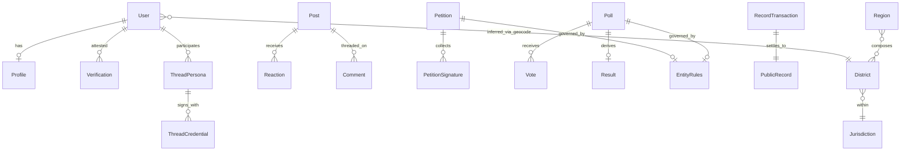

# Formal Domain Object Specifications

> **Purpose:** Unambiguous, structured definitions of every core domain noun in OurSay — what it is, what fields and states it has, what rules govern it, and where it is implemented. Use this when designing APIs, UI, schema, or audits.
>
> **Audience:** Product, design, engineering, and compliance contributors.

This library **formalizes** existing documentation; it does not replace it.

## Precedence when docs conflict

1. **[GLOSSARY.md](../GLOSSARY.md)** — vocabulary wins
2. **[public-record/REQUIREMENTS.md](../../public-record/REQUIREMENTS.md)** — record invariants (`R1`–`R28`)
3. **`docs/entities/`** (this folder) — formal object structure
4. **[01-CONTRIBUTOR-SPEC.md](../01-CONTRIBUTOR-SPEC.md)** — narrative behaviour and rationale

## Cross-cutting rules

| Rule | Detail |
|------|--------|
| Product ↔ record naming | Record types are canonical: `post`, `petition`, `poll`, `result`, `vote`, `petition_signature`. User-facing labels are per-jurisdiction (`JurisdictionConfig.labels`); defaults **Statement** (`post`), **Petition**, **Poll**, **Result**. A user's ballot = `vote`; "vote" means only that ballot, never the `poll` container. |
| Tier semantics | Set membership, not a strict ladder — see [verification.md](./account/verification.md) |
| District | Inferred from address at query time; **never stored on the user row** |
| Finality defaults | Votes and signatures are final unless `EntityRules.allowChange` / `allowRevoke` + before deadline |
| Verified-only on ledger | Unverified civic actions stay in Postgres only ([contributor §11.1](../01-CONTRIBUTOR-SPEC.md)) |
| Singleton types | One active vote, signature, or reaction per author + parent (`nullifier` dedupe) |
| Residency ≠ eligibility | Residency verification is not electoral eligibility, voter registration, or citizenship |

## Entity catalog

| Object | Product alias | Record type | Primary storage | Status |
|--------|---------------|-------------|-----------------|--------|
| [Jurisdiction](./partitioning/jurisdiction.md) | — | — | In-memory config + `record_outbox.chain_id` | [MVP] |
| [District](./partitioning/district.md) | — | — | `geo.districts` | [MVP] |
| [Region](./partitioning/region.md) | — | — | `geo.regions` + computed | [MVP] |
| [EntityRules](./partitioning/entity-rules.md) | — | — | Embedded in `petition`/`poll` content | [MVP] |
| [User](./account/user.md) | — | — | `public.users` | [MVP] |
| [Profile](./account/profile.md) | — | — | `auth.profiles` | [MVP] |
| [Verification](./account/verification.md) | KYC attestation | — | `public.kyc_attestations` | [Gap] production provider |
| [ProfileGeocode](./account/profile-geocode.md) | — | — | `auth.profile_geocodes` | [MVP] |
| [Post](./civic-content/post.md) | Statement | `post` | `record_tx` | [MVP] |
| [Petition](./civic-content/petition.md) | Petition | `petition` | `record_tx` | [MVP] |
| [PetitionSignature](./civic-content/petition-signature.md) | Signature | `petition_signature` | `record_tx` | [MVP] |
| [Poll](./civic-content/poll.md) | Poll | `poll` | `record_tx` | [MVP] |
| [Vote](./civic-content/vote.md) | Ballot | `vote` | `record_tx` | [MVP] |
| [Result](./civic-content/result.md) | Result | derived | `poll_results` view | [Gap] formal publish |
| [Comment](./civic-content/comment.md) | Discussion comment | `comment` | `record_tx` | [MVP] |
| [Reaction](./civic-content/reaction.md) | Agree / disagree | `reaction` | `record_tx` | [MVP] |
| [ThreadPersona](./civic-identity/thread-persona.md) | Thread key Pₜ | — | `public.thread_keys` | [MVP] |
| [ThreadBinding](./civic-identity/thread-binding.md) | — | — | `public.thread_bindings` | [MVP] |
| [ThreadCredential](./civic-identity/thread-credential.md) | Civic signer | — | `public.thread_civic_credentials` | [MVP] |
| [Nullifier](./civic-identity/nullifier.md) | — | — | `public.nullifier_attestations` | [MVP] |
| [RecordTransaction](./record/record-transaction.md) | — | all types | `record_tx` | [MVP] |
| [PublicRecord](./record/public-record.md) | Public record | — | immudb + `record_outbox` | [MVP] |
| [EntityProjection](./record/entity-projection.md) | — | — | `entity_state` views | [MVP] |
| [Session](./auth/session.md) | — | — | `auth.sessions` | [MVP] |
| [PasskeyCredential](./auth/passkey-credential.md) | Account passkey | — | `auth.passkey_credentials` | [MVP] |
| [EmailOtp](./auth/email-otp.md) | — | — | `auth.email_otp` | [MVP] |

## Relationship diagram



## Standard section template

Every entity file in this folder follows these sections:

| Section | Content |
|---------|---------|
| **Definition** | One-paragraph business meaning |
| **Aliases** | Product name ↔ record type ↔ code symbol |
| **Identity** | What makes two instances the same; primary key |
| **Attributes** | Field table: name, type, required, public/private, source |
| **States & lifecycle** | Enum values + allowed transitions |
| **Relationships** | Parent/child, cardinality, FK or logical link |
| **Invariants** | Must-always-be-true rules; cite `R#` where applicable |
| **Permissions** | Who can create/read/update/delete and conditions |
| **Events** | Side effects (notifications, outbox, audit) |
| **Examples** | One valid + one invalid instance |
| **Implementation** | Tables, types, services, routes |
| **Gaps** | Links to [API-GAPS-AND-ROADMAP.md](../API-GAPS-AND-ROADMAP.md) tags |

## Folder layout

```
docs/entities/
├── README.md                 ← this file
├── partitioning/             ← jurisdiction, district, region, entity-rules
├── account/                  ← user, profile, verification, profile-geocode
├── civic-content/            ← post, petition, poll, vote, result, …
├── civic-identity/           ← thread persona, binding, credential, nullifier
├── record/                   ← record-transaction, public-record, entity-projection
└── auth/                     ← session, passkey, email-otp (supporting objects)
```

## Related documents

- [01-CONTRIBUTOR-SPEC.md](../01-CONTRIBUTOR-SPEC.md) — behavioural narrative
- [10-USER-STORIES.md](../10-USER-STORIES.md) — story + acceptance layer (front-end), traces back here
- [11-USER-FLOWS.md](../11-USER-FLOWS.md) — journey layer (steps/screens/branches), wireframe prerequisite
- [GLOSSARY.md](../GLOSSARY.md) — canonical vocabulary
- [REGION-MODEL.md](../REGION-MODEL.md) — geo implementation anchor
- [08-IDENTITY-AND-DEVICE-POLICY.md](../08-IDENTITY-AND-DEVICE-POLICY.md) — signing and privacy
- [API-GAPS-AND-ROADMAP.md](../API-GAPS-AND-ROADMAP.md) — shipped vs stubbed
