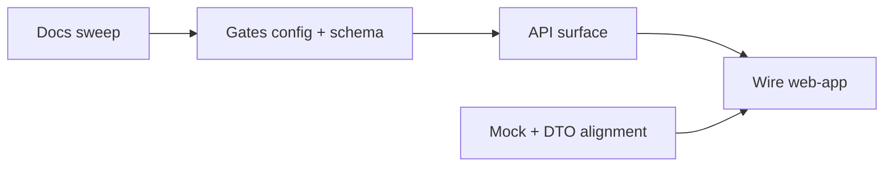

# WEB-APP-ALIGNMENT-PROMPTS

Agent prompt playbook for turning the Phase D demo into a wired app. Local only (`.agents/` is
gitignored). Companion to [`WEB-APP-GAPS.md`](./WEB-APP-GAPS.md) — **read that first; it is the
requirements document for every task below** (conflicts C1–C8, Postgres Part 2, config Part 3,
endpoints Part 4, open clarifications Part 5).

Same five-step loop as [`MVP-PROMPTS.md`](./MVP-PROMPTS.md): coding agent plans+implements, review
agent rates the plan (1–10), implement, review QA (1–10), user commits. Coding agents must **not
commit** — propose a short commit message only. Every coding-agent block includes the **No
assumptions** line near the top.

**Suggested order (dependencies):**
`[align-w1-docs]` → `[align-w2-mock-dto]` → `[align-w3-gates-schema]` → `[align-w4-api-surface]` → `[align-w5-wire]`

W1 and W2 can run in parallel. W4 requires W3. W5 requires W2 + W4.



## Session log

| Tag | Task | Session ID |
|-----|------|------------|
| `[align-w1-docs]` | Docs sweep — un-deprecations, gates, visibility, registration | ✅ done 2026-07-04 (33 docs; see WEB-APP-GAPS changelog) |
| `[align-w2-mock-dto]` | Web-app mock + DTO alignment to backend shapes | |
| `[align-w3-gates-schema]` | Jurisdiction gates config + Postgres migrations + write gates | |
| `[align-w4-api-surface]` | Public + `/v1/me` read surface (whole API surface) | |
| `[align-w5-wire]` | Swap web-app mock → live API (BFF proxy, demo fallback) | |

---

> **⚠ Post-review corrections (2026-07-04) — binding for W2–W5; where a prompt below disagrees,
> WEB-APP-GAPS.md Part 6 wins.** Highlights: gate field is **`officialCount`** (+ optional
> `deny: [{role:"official"}]`; AB denies official-role holders on vote/petition_signature);
> official count = counting floor, never an act barrier (floor = act gate); platform finality
> defaults are **loose** (`allowChange`/`allowRevoke` true — AB tightens to final);
> visibility ships with **4 values** (`anonymous | officials | my_district | public`,
> `officials` = officials affected by the post incl. jurisdiction-level role holders);
> registration = handle required, display name optional (falls back to handle), full name +
> address optional behind a helper, over_18 required; graduation: forced at threshold, AB official
> may promote early, proposer stays author, petition's **deadline is the only closing**, threshold
> = fixed n or % of verified users (platform-set at create); `result` is a gated root type
> (automated, attributed to the poll author); district routes nest under jurisdiction
> (`alberta/district/<slug>/`); `riding_slug`/`ridingSlug` must not reappear.

---

## `[align-w1-docs]` — Documentation sweep

**Conversation:** Start **fresh**. Docs only — no application code, schema, or OpenAPI changes.

### Coding agent

```
OurSay docs alignment sweep — documentation only. Align all docs to the locked decisions in
.agents/WEB-APP-GAPS.md (Part 1 conflicts C1–C7, gate matrix in C5/Part 3). Do NOT change
application code, schema, or OpenAPI in this pass.

**No assumptions — ask the user for clarification when requirements, wire format, or scope are
ambiguous.** The Part 5 clarifications queue in WEB-APP-GAPS.md lists the known open questions —
ask those up front before editing the affected sections.

## Read first
- .agents/WEB-APP-GAPS.md — the authoritative map (old assumption / change / why / affected lines)
- docs/GLOSSARY.md, docs/08-IDENTITY-AND-DEVICE-POLICY.md, docs/09-ACCOUNT-PRIVACY-MODEL.md
- docs/10-USER-STORIES.md, docs/11-USER-FLOWS.md, docs/REGION-MODEL.md, docs/ROADMAP.md
- docs/entities/** (esp. partitioning/{jurisdiction,entity-rules,region,district}.md,
  civic-content/{vote,petition,petition-signature}.md, civic-identity/*, account/*)
- web-app/src/lib/types/{signing,sign-tier,visibility,verification}.ts and
  web-app/src/lib/read-model/{geography,visibility}.ts — the demo policies being canonized

## Goals
1. C1 — un-deprecate soft keys: quick-sign is a first-class production method; remove
   "legacy p256 / retire" language; document per-action signing prefs + per-gate jurisdiction
   floors, strongest wins; document signTier (0 quick · 1 passkey · 2/3 biometric future) as a
   read-surface projection. Replace the vote/petition_signature hard-override invariant with the
   per-jurisdiction gate rule everywhere WEB-APP-GAPS C1 lists.
2. C2 — un-deprecate the district-id list: affectedRegion (filtering) + affectedDistrictIds
   (server-projected stable district slugs on DTOs) are BOTH kept; entity_audience moves out of
   partitioning/future.md into the district/entity-rules specs. Apply the naming decision from the
   clarification answer consistently (docs + superseded-terms table).
3. C3 — registration flow: email OTP + handle + display name only; PII at KYC; update 11-USER-FLOWS
   §1.1, profile.md attribute requirements, verification.md (KYC collects name/address).
4. C4 — rewrite 09-ACCOUNT-PRIVACY-MODEL: 7-value visibility enum, cascade
   thread ?? account ?? anonymous with thread overrides winning in EITHER direction (widen is a
   deliberate warned act), profile surface 404 gating, handle/display_name required; update
   user.md and thread-persona.md (reveal = retroactive visibility change on a past thread).
5. C5 — resolve the <DECISION> markers in 11-USER-FLOWS §act-eligibility with the locked gate
   matrix (WEB-APP-GAPS C5 table); document the JurisdictionGates shape (Part 3) in
   partitioning/jurisdiction.md as target config; note the ab-ca-gov counts.minTier consequence.
6. C6 — document authorGeo relation DTOs (relationships, never locations) in REGION-MODEL,
   06-PRIVACY-REVIEW disclosure matrix, and API-GAPS constraints; note optional-session public
   reads and the caching trade-off.
7. C7 — thread-persona.md: persona display names (globally unique, minted at join), persona page
   surface, 404 anonymity patterns.
8. Final ripgrep audit: no stray "deprecated" on appliesToDistrictIds/soft-key language without
   context; no remaining <DECISION> markers; GLOSSARY superseded-terms table updated.

## Deliverables
- Edited docs per WEB-APP-GAPS Part 1 affected-lines lists (re-grep anchors before editing)
- A short changelog appended to WEB-APP-GAPS.md ("Docs swept YYYY-MM-DD: ...")
- List of any code-alignment gaps you documented that are NOT already covered by tasks
  [align-w2..w5] — append them as new prompt blocks to this file, MVP-PROMPTS style

## Constraints / Out of scope
- No code, schema, or openapi.yaml changes; no commits (propose commit message)
- Do not delete API-GAPS-AND-ROADMAP.md or CONTRACT.md — banner/cross-link updates only
```

### Review agent — plan

```
Review the [align-w1-docs] plan against .agents/WEB-APP-GAPS.md Part 1. Check every conflict C1–C7
has a concrete doc-edit list, the clarifications in Part 5 were asked (not assumed), and no code
changes are planned. Score 1–10; list blockers vs nits.
```

### Review agent — QA

```
QA the [align-w1-docs] doc sweep (docs only — verify no code changed via git status).
Check: hard-override language gone everywhere C1 lists; district-id list un-deprecated with the
chosen naming applied consistently; 09 rewritten to the widen-or-narrow thread cascade + 404 rule;
<DECISION> markers resolved to the locked matrix; authorGeo documented as the only residence signal;
persona names specified; GLOSSARY consistent; ripgrep audit clean. Score 1–10. Do not commit.
```

---

## `[align-w2-mock-dto]` — Web-app mock + DTO alignment (the "align mock to backend" pass)

**Conversation:** Start **fresh**.

### Coding agent

```
Align the web-app's mock data and DTO layer to the real backend shapes so the later fetch swap is
mechanical. Demo behaviour must be preserved (all views keep working against the mock).

**No assumptions — ask the user for clarification when requirements, wire format, or scope are
ambiguous.**

## Read first
- .agents/WEB-APP-GAPS.md — C1, C2, C4, C5, C8 (the M1–M9 cheat table is this task's checklist)
- web-app/src/lib/{types,mock,api,read-model,state}/ — current shapes and seams
- web-app/src/lib/compose-eligibility.ts, web-app/src/components/chrome/RegisterForm.tsx
- public-record/src/jurisdiction.ts (JurisdictionConfig), jurisdiction-data/*/jurisdiction.ts
- api/openapi.yaml — existing public read response shapes

## Goals
1. M1 — jurisdiction identity: key everything by id (oursay-global, ab-ca-gov) with label for
   display; JurisdictionSummary gains id/level/labels (record-type + district labels come from
   config, not hardcoded strings).
2. M2+M3 — gates: add a typed JurisdictionGates config (WEB-APP-GAPS Part 3 shape) to the mock
   layer; rewrite compose-eligibility.ts to derive from it (no jurisdiction-name switches); add
   role to ViewerContext and implement AB officials-only poll creation; AB petition creation stays
   residency-verified (Part 5 resolved).
3. M4 — official counts: RecordOption/petition tallies carry official vs live totals per the gate
   config's official definition; sign modal notices derive from the same config.
4. M5 — RegisterForm: handle (required) / display name (optional — falls back to handle) /
   email / over-18 (required) + optional full name & address behind the helper copy (Part 6 #8).
5. M8 — signTier on mock rows derives from each jurisdiction's signMin floor (no hand-set values
   that contradict the config).
6. C2 naming — canonical names stay `appliesToRegion` / `appliesToDistrictIds` (Part 5 resolved:
   keep `appliesTo*`); rename FeedItem/RecordDetail `districts` to align with the served
   `appliesToDistrictIds` projection (or document the mapping explicitly in CONTRACT.md); keep
   field semantics (author residence stays server-internal, authorGeo is the served relation).
7. Part 6 items — nest district routes under the jurisdiction
   (`district/<slug>/` → `<jurisdiction>/district/<slug>/`, avoiding cross-jurisdiction slug
   collisions); trim the visibility picker/enum handling to the 4 shipped values with
   officials-affected-by-post semantics; keep the two intentional gaps (compose "Affects Specific
   District(s)" field, historical district nav/pages) documented as future, don't add them
   silently.
8. Keep all read-model unit tests green; extend them for the gate-driven compose eligibility and
   officials-only polls.

## Deliverables
- Updated types/mock/api/read-model with no behaviour regressions (walk all seven views)
- Updated CONTRACT.md Part 1/2 rows where shapes changed
- Unit tests for gates derivation + naming migration; `npm run build -w web-app` + tests pass

## Constraints / Out of scope
- No live fetch calls (that is [align-w5-wire]); no backend changes
- Do not redesign filters/UI — shape alignment only
```

### Review agent — plan

```
Review the [align-w2-mock-dto] plan against WEB-APP-GAPS C8 (M1–M9) + Part 3. Check: ids vs labels
separation, gates-config-driven eligibility (no name switches), officials role, register slimming,
naming migration scope, test plan. Score 1–10; blockers vs nits.
```

### Review agent — QA

```
QA [align-w2-mock-dto]: run build + tests; walk Feed/Post/Jurisdiction/District/Profile/Persona/
Self-profile views in the dev server. Verify: no "Global"/"Alberta" string keys left in logic
(display only), compose eligibility fully config-driven, AB polls officials-only, RegisterForm has
no name/address fields, signTier consistent with floors, CONTRACT.md updated. Score 1–10. Do not
commit.
```

---

## `[align-w3-gates-schema]` — Jurisdiction gates config, Postgres migrations, write-path enforcement

**Conversation:** Start **fresh**.

### Coding agent

```
Implement the per-jurisdiction gate model (act / signMin / official per action), the Postgres
schema changes from WEB-APP-GAPS Part 2, and enforce the gates fail-closed on the civic write path.
This replaces the platform-wide webauthn-es256 hard override.

**No assumptions — ask the user for clarification when requirements, wire format, or scope are
ambiguous.** WEB-APP-GAPS Parts 5–6 are fully resolved — key decisions: AB petition create =
residency-verified + passkey; over_18 = signup checkbox (birthdate drops); official = platform
role, not a tier; Global officialCount = {identity_verified, residency_verified}; default
visibility = anonymous; cascade = thread ?? account ?? anonymous. Part 6 corrections: gate field
`officialCount` (+ `deny`; AB denies official-role holders on vote/petition_signature — vote
act-blocked, signatures count-excluded with reason `official_role`); loose platform finality
defaults (allowChange/allowRevoke true; AB config stays final); `result` in JurisdictionGates
(automated, mirrors poll, attributed to poll author); graduation threshold = fixed n or
percentOfVerified (moving|atCreate), platform-set at create, manual early promotion by AB
officials, petition deadline is the only closing; registration = handle required + over_18, all
else optional (displayName falls back to handle); visibility enum ships 4 values.

## Read first
- .agents/WEB-APP-GAPS.md — C1, C3, C4, C5, C6, Part 2 (schema), Part 3 (gate shape)
- public-record/src/jurisdiction.ts (requiredSignScheme), governance.ts, schema/postgres.sql.ts
- jurisdiction-data/*/jurisdiction.ts, api/src/schema/auth.sql.ts
- api/src/services/{registration,civic-record}.service.ts, api/src/http/routes/{registration,
  civic-record}.routes.ts, api/src/http/schemas.ts
- docs/entities/partitioning/jurisdiction.md (post-W1 gate docs)

## Goals
1. Config: add JurisdictionGates (Part 3 shape) to JurisdictionConfig; populate oursay-global and
   ab-ca-gov per the locked matrix; keep counts.minTier consistent with official gates (AB drops
   identity_verified).
2. Signing: replace requiredSignScheme's hard override with gate resolution (signMin per action;
   p256 accepted where signMin === "quick"); verify the WebAuthn UV flag for passkey-floor actions;
   derive sign_tier per tx.
3. Enforcement at prepare/submit: act gates (anyone / tier set / residencyIn jurisdiction via
   ParticipantGeoService / role), fail-closed with typed errors the UI can map to lock reasons.
4. Migrations (Part 2): users handle/display_name NOT NULL; profiles.over_18 (drop birthdate per
   [code-over-18]); auth.jurisdiction_memberships (+ auto oursay-global at registration);
   auth.signing_prefs; profiles.visibility + auth.visibility_overrides; thread_bindings.visibility;
   thread_keys.persona_name (mint at join); entity_audience projection (root create + governance
   update refresh); record_action_geo relationship snapshot at submit; mention_index; share_marks.
5. Registration: slim profileInputSchema (handle + displayName required; no name/address/birthdate);
   geocode sync moves to first address write (KYC/PATCH).
6. Tests: gate matrix table-driven tests (both jurisdictions × all actions), quick-sign vote
   accepted on oursay-global, rejected on ab-ca-gov without passkey+residency, registration slims,
   migrations idempotent.

## Deliverables
- Updated public-record + jurisdiction-data + api schema/services with green test suites
- openapi.yaml updated for changed write/registration request/response shapes
- Migration notes in the PR description (backfill strategy for handle/display_name)

## Constraints / Out of scope
- No new read endpoints (that is [align-w4-api-surface]); existing reads must not break
- Persona→user linkage never appears on any public response or new public column
```

### Review agent — plan

```
Review the [align-w3-gates-schema] plan against WEB-APP-GAPS Parts 2–3 and C1/C5. Check: hard
override removal is complete (no vote/petition_signature special case left), UV flag actually
verified for passkey floors, residencyIn resolution uses region containment not stored districts,
migrations cover every Part 2 row with backfills, blocking clarifications asked. Score 1–10.
```

### Review agent — QA

```
QA [align-w3-gates-schema]: run the api + public-record test suites. Spot-check: quick-signed vote
settles on oursay-global; ab-ca-gov rejects a quick-signed statement and a non-resident vote;
registration succeeds with only email/otp/handle (displayName optional, falls back to handle); persona_name minted unique at join;
entity_audience rows appear for a district-scoped root; no public route returns persona→user or
raw districts. Score 1–10. Do not commit.
```

---

## `[align-w4-api-surface]` — The whole read/viewer API surface

**Conversation:** Continue `[align-w3-gates-schema]` or **fresh** (requires W3 landed).

### Coding agent

```
Implement the full public + /v1/me API surface from WEB-APP-GAPS Part 4 (P1–P9, A1–A8) — the
endpoints the web-app's CONTRACT.md functions map onto. Public reads take an OPTIONAL session and
resolve viewer-dependent fields (identity reveal, authorGeo, _my/_vote) server-side.

**No assumptions — ask the user for clarification when requirements, wire format, or scope are
ambiguous.**

## Read first
- .agents/WEB-APP-GAPS.md — Part 4 (endpoint table), C4 (404 rules), C6 (authorGeo), C7 (personas)
- web-app/src/lib/api/CONTRACT.md + web-app/src/lib/types/ — the DTO contract to satisfy
- web-app/src/lib/read-model/{geography,visibility}.ts + web-app/src/lib/api/identity.ts — the
  resolution semantics to port server-side (authorGeoRelation, isRevealed, persona rendering)
- api/src/http/routes/public-*.routes.ts, api/src/services/, @oursay/geo ParticipantGeoService

## Goals
1. P1 unified feed: cursor-paginated, filters jurisdictions[]/types[]/tierMin/signedMin; rows carry
   FeedItem fields incl. affectedDistrictIds, signTier, editCount, commentCount, authorGeo,
   viewer-resolved identity (persona or revealed handle).
2. P2/P3 record detail + comment tree (depth ≤ 3): interlinks (sourcePetitionId/sourcePollId/
   resultId), attachedPoll, editCount; same identity/authorGeo resolution on every node.
3. P4/P5 profiles: 404 when viewer out of the account's effective visibility scope; posts /
   activity / mentions tabs (mention_index, per-author activity projection).
4. P6 personas: thread-scoped profile by persona_name; nothing derivable beyond the one thread.
5. P7/P8 jurisdiction detail (labels, gates, leader, rules copy) + district detail by slug.
6. P9 counts: ?official=true applies the jurisdiction's official gate (tier set / residencyIn).
7. A1–A8 /v1/me surface: memberships, signing-prefs, visibility (account + per-thread PUT),
   districts (self-only), record-state batch, shares, profile PATCH (+ geocode sync), Didit KYC
   session seam (stub provider acceptable behind the seam).
8. Identity resolution server-side: reveal per effective visibility (thread ?? account ??
   anonymous), persona display otherwise; self always revealed to self with seenByOthersAs hint.
9. openapi.yaml for every route; integration tests per endpoint incl. the 404-not-403 privacy
   cases and the anonymous-vs-authed variant of one feed read.

## Deliverables
- Routes + services + projections with tests green; openapi.yaml complete
- A short CONTRACT-MAPPING.md (or CONTRACT.md update) table: frontend function → real route

## Constraints / Out of scope
- No web-app changes (W5 wires it); no CORS/BFF decisions here beyond keeping same-origin viable
- k-anonymity floors still apply to any aggregate; authorGeo is per-author relation, never a count
```

### Review agent — plan

```
Review the [align-w4-api-surface] plan against WEB-APP-GAPS Part 4 and the CONTRACT.md functions.
Check: every P/A row has an owner in the plan, viewer-optional reads are designed (session parsing
on public routes), identity/authorGeo resolution ports the web-app read-model semantics exactly,
404 privacy semantics on profiles/personas, projection strategy for feed/activity/mentions is
stated. Score 1–10.
```

### Review agent — QA

```
QA [align-w4-api-surface]: run api tests; curl the surface as (a) anonymous, (b) an authed
residency-verified viewer. Verify: feed rows carry authorGeo/identity and never raw author
districts; a private profile 404s for out-of-scope viewers and 200s in-scope; persona page leaks
nothing cross-thread; ?official=true matches the gate config; /v1/me/record-state round-trips a
reaction. openapi.yaml matches implementations. Score 1–10. Do not commit.
```

---

## `[align-w5-wire]` — Wire the web-app to the live API (wooden puppet → real boy)

**Conversation:** Start **fresh** (requires W2 + W4 landed).

### Coding agent

```
Swap the web-app's lib/api functions from mock-backed to fetch-backed against the real
/v1/public + /v1/me surface, behind the existing function signatures, with a same-origin proxy
(Next.js rewrite or BFF route handlers — pick with the user) and a demo-mode fallback flag that
keeps the mock corpus working offline.

**No assumptions — ask the user for clarification when requirements, wire format, or scope are
ambiguous.** Ask up front: proxy vs BFF preference, and whether demo mode is a build flag or
runtime toggle.

## Read first
- .agents/WEB-APP-GAPS.md — Part 4 mapping; C8 (M6/M7/M9 — the cheats that die in this task)
- web-app/src/lib/api/* (every function body changes; signatures/DTOs must not)
- The W4 CONTRACT mapping table + api/openapi.yaml
- api CORS note in docs/API-GAPS-AND-ROADMAP.md (App and ops)

## Goals
1. Fetch adapters per lib/api module (feed, record, profile, persona, places, membership,
   identity-resolution fields now come pre-resolved on DTOs — delete the client-side anonymize/
   authorGeo passes, keeping the read-model helpers for filter logic only).
2. Auth/session: cookie session flows for register (slim form) / OTP / passkey login against the
   real routes; viewer context (kycTier, role, districts via /v1/me/districts) hydrates AppProvider.
3. Writes: reactions, comments, votes, signatures, compose go through join → prepare → submit with
   the signing chooser honoring /v1/me/signing-prefs + jurisdiction floors; share tally and
   per-thread visibility PUT wired.
4. Filters: server-side params (jurisdictions, types, tierMin, signedMin) hit the feed endpoint;
   client-side-only refinements (geography modes on an open post) keep using read-model helpers
   over served DTOs.
5. Demo fallback: OURSAY_DEMO=1 (or chosen mechanism) restores today's mock-backed behaviour;
   scaleSocial thinning lives only behind it.
6. E2E smoke (Playwright or existing tooling): register → verify (dev KYC) → subscribe AB → post
   statement (passkey mock) → quick-sign comment → vote rejected pre-residency → persona page →
   private profile 404.

## Deliverables
- Fetch-backed lib/api with all views working against a locally running api; demo mode intact
- Proxy/BFF wiring + README run instructions (both modes); e2e smoke green
- CONTRACT.md updated: functions marked live vs mock-only

## Constraints / Out of scope
- No visual/UX redesign; no new endpoints (file gaps back to WEB-APP-GAPS instead)
- Never ship the mock corpus to production bundles outside demo mode
```

### Review agent — plan

```
Review the [align-w5-wire] plan. Check: every lib/api function has a route target from the W4
mapping, client-side anonymization/authorGeo passes are removed (server now resolves), demo
fallback is isolated, session hydration order is defined (no logged-out flash of private data),
e2e scenario list matches the Goals. Score 1–10.
```

### Review agent — QA

```
QA [align-w5-wire]: run api + web-app together; execute the e2e smoke. Verify each view renders
from live data with the mock import graph unused outside demo mode; writes settle end-to-end;
signing chooser honors prefs + floors; 404 privacy behaviours reach the UI as designed. Score
1–10. Do not commit.
```
